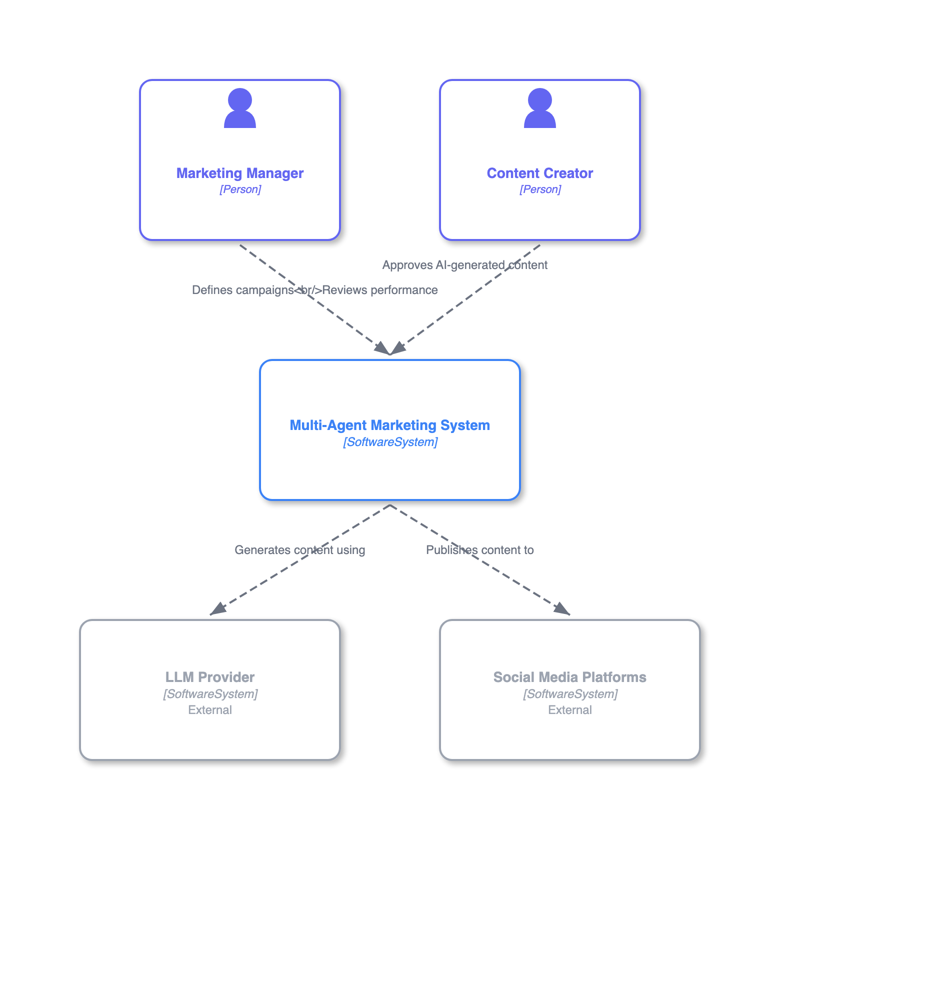
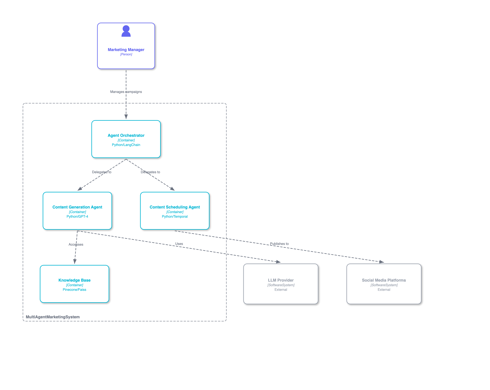

# C4X - C4 Model Diagrams for VS Code
>
> **Status (2025-12-01)**: ✅ **v1.0 STABLE** - Visual styling now matches official C4 Model standards.


[](https://www.typescriptlang.org/)


> **Make C4 architectural diagrams as easy as Mermaid in VS Code** - Jaroslav

Fast, offline, Mermaid-inspired C4 diagrams with real-time preview and support for multiple DSL formats.

## ✨ Features

- ⚡ **Instant preview** - Sub-50ms rendering for 30-node diagrams
- 🔍 **Real-time Validation** - Syntax highlighting and error reporting as you type
- 📝 **Markdown Integration** - Render ` ```c4x ` blocks directly in your README files
- 🎨 **5 built-in themes** - Classic, Modern, Muted, High Contrast, Auto
- 📝 **Simple DSL** - Mermaid-inspired C4X syntax
- 🚀 **Zero dependencies** - No Java, no Graphviz, no external servers
- 📦 **Tiny bundle** - 386KB (63% under 1MB target)
- 🔒 **Secure** - CSP-compliant, no external CDN dependencies
- 📤 **Export** - SVG/PNG with theme preservation
- ⚡ **Lightning fast activation** - 0.15ms startup (99.9% faster than 200ms target)

## 🚀 Quick Start

### Installation

**From VS Code Marketplace** (Recommended):

1. Open VS Code
2. Press `Ctrl+Shift+X` (or `Cmd+Shift+X` on Mac)
3. Search for "C4X"
4. Click "Install"

**From Command Line**:

```bash
code --install-extension jpantsjoha.c4x
```

### Usage

1. **Create a C4X file**: `banking-system.c4x`
2. **Write your diagram**:

   ```c4x
   %%{ c4: system-context }%%
   graph TB

   Customer[Customer<br/>Person]
   Banking[Banking System<br/>Software System]
   Email[Email System<br/>Software System<br/>External]

   Customer -->|Uses| Banking
   Banking -->|Sends notifications| Email
   ```

3. **Open preview**: Press `Ctrl+K V` (or `Cmd+K V` on Mac)
4. **See instant results**: Your diagram renders in < 50ms!

That's it! No Java, no servers, no configuration needed.

### Markdown Integration

You can embed C4X diagrams directly in your markdown files (e.g., `README.md`, `ARCHITECTURE.md`).

````text
# My Architecture

Here is the system context:

```c4x
%%{ c4: system-context }%%
graph TB
    User[User<br/>Person]
    System[My System<br/>Software System]
    User -->|Uses| System
```
````

The extension will automatically render this code block as a visual SVG diagram in the VS Code Markdown Preview.

## 📚 Examples & Use Cases

C4X makes it easy to visualize complex architectures, from traditional web apps to advanced AI agent systems.

### Featured Example: Multi-Agent Marketing System (C1 - System Context)

This diagram visualizes the high-level interactions for an AI-powered marketing system, featuring human roles, the multi-agent platform, and external AI services.



### C2: Multi-Agent Orchestrator (Container Diagram)

A container-level view of the Multi-Agent Marketing System, detailing the main building blocks within the Multi-Agent System.



For more examples, including theme showcases and other system architectures, refer to the full [C4X Examples Gallery](./EXAMPLES.md).

---

## 📖 C4X-DSL Syntax Guide

### Elements

```text
ElementID[Label<br/>Type<br/>Tags]
```

**Supported Types**:

- `Person` - Users of the system
- `Software System` - High-level software systems
- `Container` - Applications, services, databases
- `Component` - Code-level components

**Example**:

```c4x
Admin[Administrator<br/>Person]
API[Payment API<br/>Software System]
DB[User Database<br/>Container<br/>Internal]
```

### Relationships

```text
%% Uses (Dashed)
FromID -->|Label| ToID
%% Async (Dashed)
FromID -.->|Label| ToID
%% Sync / Strong (Solid)
FromID ==>|Label| ToID
```

**Example**:

```c4x
User[User<br/>Person]
Dashboard[Reporting Dashboard<br/>Container]
API[Reporting API<br/>Container]
Database[Reporting Database<br/>Container]

User -->|Views reports| Dashboard
Dashboard -.->|Fetches data| API
API ==>|Queries| Database
```

### Boundaries / Subgraphs

Group elements into systems or containers using subgraphs.

```text
subgraph BoundaryId {
    Element1[Label<br/>Type]
    Element2[Label<br/>Type]
}
```

**Example**:

```c4x
graph TB
    User[User<br/>Person]

    subgraph BankingSystem {
        WebApp[Web App<br/>Container]
        Database[DB<br/>Container]
    }

    User -->|Uses| WebApp
    WebApp ==>|Reads/Writes| Database
```

### View Types

```text
%% C1 - System Context
%%{ c4: system-context }%%
%% C2 - Container (coming soon)
%%{ c4: container }%%
%% C3 - Component (coming soon)
%%{ c4: component }%%
```

## 🎨 Themes

Choose from 5 built-in themes to match your documentation style:

| Theme | Description | Use Case |
|-------|-------------|----------|
| **Classic** | Official C4 Model colors (Simon Brown spec) | Standard C4 documentation |
| **Modern** | Vibrant colors with rounded corners | Presentations, modern docs |
| **Muted** | Grayscale minimalist | Professional reports, B&W printing |
| **High Contrast** | WCAG AAA compliant (7:1 ratio) | Accessibility, readability |
| **Auto** | Adapts to VS Code light/dark theme | Match your editor theme |

**Change Theme**:

- Command Palette: `C4X: Change Theme`
- Settings: `"c4x.theme": "modern"`

## 📤 Export Diagrams

Export your diagrams to SVG or PNG with theme preservation:

**Export Commands**:

- `C4X: Export SVG` - Vector format for editing (Figma, Sketch, Adobe Illustrator)
- `C4X: Export PNG` - Raster format for documentation and presentations
- `C4X: Copy SVG to Clipboard` - Quick paste into other applications

**Features**:

- ✅ Theme preservation (exported diagrams match your selected theme)
- ✅ High-quality rendering (no pixelation in SVG)
- ✅ Design tool compatibility (Figma, Sketch tested)
- ✅ Small file sizes (~20-50KB for typical diagrams)

## 📋 Commands

| Command | Shortcut | Description |
|---------|----------|-------------|
| `C4X: Open Preview` | `Ctrl+K V` (Mac: `Cmd+K V`) | Open live preview panel |
| `C4X: Export SVG` | - | Export diagram to SVG file |
| `C4X: Export PNG` | - | Export diagram to PNG file |
| `C4X: Copy SVG to Clipboard` | - | Copy SVG to clipboard |
| `C4X: Change Theme` | - | Switch between 5 built-in themes |

## ⚡ Performance

Exceeds all targets by 72-99%:

| Metric | Target | Achieved | Status |
|--------|--------|----------|--------|
| **Activation Time** | < 200ms | **0.15ms** | ✅ 99.9% faster |
| **Bundle Size** | < 1MB | **386KB** | ✅ 63% under target |
| **C4X Parse** | < 50ms | **10ms avg** | ✅ 80% faster |
| **Preview Render** | < 250ms | **55ms avg** | ✅ 78% faster |
| **Full Pipeline** | < 300ms | **55ms avg** | ✅ 82% faster |

**Tested with**: 30-node diagrams (typical real-world size)

## 🛠️ Configuration

### Settings

Configure C4X in your VS Code settings (`Ctrl+,` or `Cmd+,`):

```json
{
  // Choose your preferred theme
  "c4x.theme": "classic",
  // Options: "classic", "modern", "muted", "high-contrast", "auto"
}
```

### File Associations

C4X automatically recognizes these file extensions:

- `.c4x` - C4X-DSL (Mermaid-inspired syntax)

## 🏗️ Project Status

**Phase 1 (M0 - Scaffolding)**: ✅ Complete (v0.1.0)
**Phase 2 (M1 - C4X-DSL MVP)**: ✅ Complete (v0.2.0)
**Phase 3 (M2 - Themes & Export)**: ✅ Complete (v0.3.0)
**Phase 4 (M3 - Structurizr DSL)**: ⏳ Deferred to v1.2
**Phase 5 (M4 - PlantUML C4)**: ⏳ Deferred to v1.2

See [docs/STATUS.md](./docs/STATUS.md) for detailed roadmap.

## 🗺️ Roadmap

### v1.0.0 (December 2025) ✅ Shipping Release

- ✅ C4X-DSL with Mermaid-inspired syntax (100% working)
- ✅ 5 built-in themes with instant switching
- ✅ SVG/PNG export with theme preservation
- ✅ Sub-50ms rendering for 30-node diagrams

### v1.1.0 (Q1 2026) 🚧 UX & Tooling

- 🔨 **Markdown Inline Rendering** - Render ```c4x code blocks anywhere
- 🔨 **Diagnostics Panel** - Live error highlighting and quick fixes
- 🔨 **Smart Templates** - Boilerplate generators for C1-C4 views

### v1.2.0 (Q2 2026) 🏗️ Advanced Visuals & Compatibility

- 🔮 **Deployment Diagrams** - Visualize infrastructure (Nodes, Pods, Regions)
- 🔄 **Dynamic Diagrams** - Visualize runtime message flows (Sequence-like)
- 🔌 **Compatibility** - Support for PlantUML C4 and Structurizr DSL

### v2.0.0 (Q3 2026) 🤖 AI & Agents

- 🧠 **Agent Syntax** - First-class support for `AI_Agent`, `Memory`, `Tool`
- ✨ **Generative Architecture** - Text-to-Diagram via LLM integration
- 🛡️ **Architecture Analysis** - Automated detection of bottlenecks and security risks

## 📚 Documentation

- [Architecture](./docs/architecture/README.md) - Technical architecture and design decisions
- [Contributing](./CONTRIBUTING.md) - Contribution guidelines
- [Technical Decisions](./docs/adrs/) - Architecture Decision Records (11 TDRs)
- [Phase Documentation](./docs/phases/) - Development phase reports

## 🤝 Contributing

Contributions welcome! We'd love your help to make C4X even better.

**Ways to contribute**:

- 🐛 Report bugs or suggest features via [GitHub Issues](https://github.com/jpantsjoha/c4x-vscode-extension/issues)
- 📝 Improve documentation or examples
- 🎨 Design new themes or icons
- 🧪 Write tests for edge cases
- ⚡ Performance optimizations

See [CONTRIBUTING.md](./CONTRIBUTING.md) for detailed guidelines.

## 👤 More from the Author

Check out my other VS Code extension:

- **[Pine Script™ (v5)](https://marketplace.visualstudio.com/items?itemName=jpantsjoha.pine-script-v5)** - Syntax highlighting, snippets, and linting for TradingView's Pine Script.
  - [GitHub Repository](https://github.com/jpantsjoha/pinescript-vscode-extension)

## 📄 License

MIT License - see [LICENSE](./LICENSE) for details.

## 🙏 Acknowledgments

- [C4 Model](https://c4model.com/) by Simon Brown - The architectural modeling standard
- [Mermaid.js](https://mermaid.js.org/) - Inspiration for C4X-DSL syntax
- [Dagre.js](https://github.com/dagrejs/dagre) - Hierarchical graph layout engine

Read more about the [Story Behind C4X](./ABOUT.md).

---

**Made with [Gemini](https://blog.google/products/gemini/gemini-3/) ❤️ for architects who value simplicity** | [Report Issues](https://github.com/jpantsjoha/c4x-vscode-extension/issues) | [Star on GitHub](https://github.com/jpantsjoha/c4x-vscode-extension)
