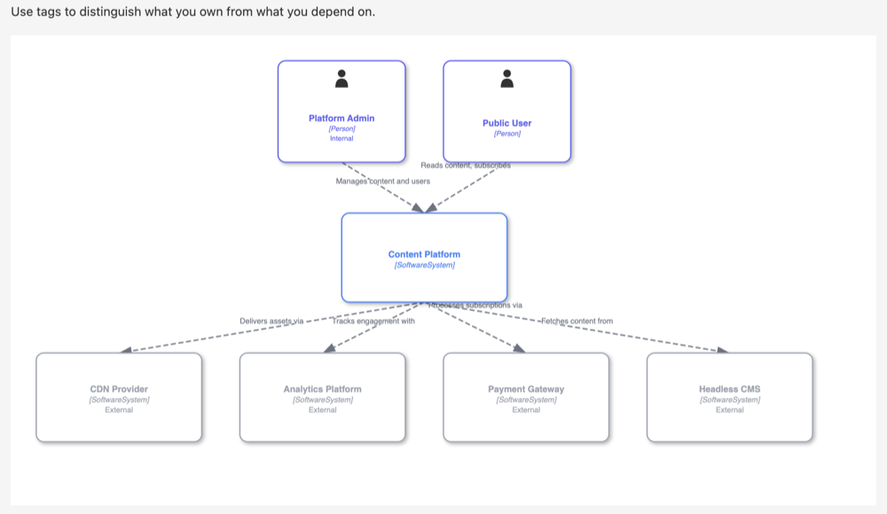

# C4X - C4 Model Diagrams for VS Code


[](https://www.typescriptlang.org/)


Fast, offline C4 architecture diagrams with real-time preview and AI-powered generation via Google Gemini. Mermaid-inspired DSL, C4-compliant SVG rendering, PNG export, and 1500+ cloud icons.



## Features

- **Instant Preview** -- Sub-50ms rendering for 30-node diagrams, live as you type
- **AI Generation (Gemini)** -- Code-to-diagram, text-to-diagram, and visual PNG generation
- **All C4 Levels** -- System Context, Container, Component, Deployment, and Dynamic views
- **6 Themes** -- C4 Standard (default), Classic, Modern, Muted, High Contrast, Auto
- **Export** -- PNG (1x/2x/4x), SVG, Copy SVG with theme preservation
- **1500+ Icons** -- AWS, Azure, GCP with IntelliSense autocomplete (`$sprite` syntax)
- **Markdown Integration** -- Render `c4x` blocks directly in README and architecture docs
- **Auto-Layout** -- Smart direction selection: horizontal for small, vertical for large diagrams
- **Self-Correcting AI** -- Parser-validated output with automatic retry and self-remediation
- **MCP Server** -- Built-in validator for Claude, Cursor, and other AI assistants

### Watch 30s Demo

[](https://youtu.be/qR1bbctj2rQ)

## Quick Start

### Install

**VS Code Marketplace** (recommended): Search "C4X" in Extensions (`Cmd+Shift+X`) and install.

**Command line**: `code --install-extension jpantsjoha.c4x`

### Create a Diagram

1. Create a file `architecture.c4x`
2. Write your diagram:

```c4x
%%{ c4: system-context }%%
graph TB

Customer[Customer<br/>Person]
Banking[Banking System<br/>Software System]
Email[Email System<br/>Software System<br/>External]

Customer -->|Uses| Banking
Banking -->|Sends notifications| Email
```

1. Open preview: `Cmd+K V` (or `Ctrl+K V`)

No Java, no servers, no configuration needed.

### Embed in Markdown

````text
```c4x
%%{ c4: system-context }%%
graph TB
    User[User<br/>Person]
    System[My System<br/>Software System]
    User -->|Uses| System
```
````

The extension renders `c4x` code blocks as visual diagrams in VS Code's Markdown Preview.

## DSL Syntax

### Elements

```text
%% Bracket syntax
Admin[Administrator<br/>Person]
API[Payment API<br/>Software System<br/>External]

%% Function syntax (supports icons, technology, description)
Container(WebApp, "Web App", "React", $sprite="c4xicons.aws.elastic-beanstalk-application")
ContainerDb(DB, "Database", "PostgreSQL")
Person(User, "End User")
```

Types: `Person`, `Software System`, `Container`, `ContainerDb`, `Component`, `ComponentDb`, plus `*_Ext` variants for external elements.

### Relationships

```text
A -->|Label| B        %% Standard dependency
A ==>|Label| B        %% Synchronous / blocking
A -.->|Label| B       %% Asynchronous / event-driven
```

### Boundaries

```c4x
%%{ c4: container }%%
graph TB
    User[User<br/>Person]

    subgraph BankingSystem {
        WebApp[Web App<br/>Container]
        Database[DB<br/>Container]
    }

    User -->|Uses| WebApp
    WebApp ==>|Reads/Writes| Database
```

### View Types

```text
%%{ c4: system-context }%%      %% C1
%%{ c4: container }%%           %% C2
%%{ c4: component }%%           %% C3
%%{ c4: deployment }%%          %% C4
%%{ c4: dynamic }%%             %% Sequence/interaction
```

Full reference: [Syntax Guide](./docs/c4x-syntax.md)

## AI Generation (Gemini)

C4X uses Google Gemini to generate diagrams from code, text, or selections.

**Setup**: Get a free API key from [Google AI Studio](https://aistudio.google.com/) or use a [Google Cloud](https://cloud.google.com/) Vertex AI key for enterprise compliance. Keys are stored in VS Code's encrypted SecretStorage.

**Default model**: `gemini-3-flash-preview` (free tier) with automatic fallback to `gemini-3.1-pro-preview`. Configure any Gemini model via `c4x.ai.model` in settings.

| Command | What it does |
|---------|-------------|
| `C4X: Generate Diagram Here` | Generate C4X diagram at cursor from context |
| `C4X: Generate from Selection` (`Alt+V`) | Generate visual PNG from highlighted text |
| `C4X: Generate from Workspace` | Analyze code files and create C4 model |

All AI-generated diagrams are parser-validated with up to 3 self-correction retries.

Full guide: [Gemini AI Guide](./docs/GEMINI_GUIDE.md) | [Visual Diagram Guide](./docs/DIAGRAM-WITH-GEMINI-IMAGE.md)

## Icons

1500+ built-in cloud and technology icons with IntelliSense autocomplete.


```c4x
Container(S3, "Storage", "AWS S3", $sprite="c4xicons.aws.simple-storage-service-bucket")
ContainerDb(DB, "Database", "Cloud SQL", $sprite="c4xicons.gcp.cloudsql")
```

Full icon catalog: [Icons & Examples](./docs/EXAMPLES-with-ICONS.md)

## Export

| Command | Format | Notes |
|---------|--------|-------|
| `C4X: Export PNG` | PNG | 1x, 2x, or 4x resolution. Canvas-based, no Chromium. |
| `C4X: Export SVG` | SVG | Vector format for Figma, Sketch, Illustrator |
| `C4X: Copy SVG to Clipboard` | SVG | Quick paste into other apps |

Exported diagrams preserve your selected theme.

## Themes

| Theme | Description |
|-------|-------------|
| **C4 Standard** | Official filled-box convention (default) |
| Classic | White-fill with colored borders |
| Modern | Vibrant colors, rounded corners |
| Muted | Grayscale minimalist |
| High Contrast | WCAG AAA compliant |
| Auto | Adapts to VS Code light/dark |

Change via Command Palette (`C4X: Change Theme`) or settings (`"c4x.theme": "modern"`).

## Examples & Documentation

| Guide | Content |
|-------|---------|
| [Example Gallery](./docs/EXAMPLES.md) | Banking, Microservices, AI Agents |
| [All C4 View Levels](./docs/EXAMPLES-VIEWS.md) | C1-C4 + Dynamic, relationship types, database variants |
| [Architecture Patterns](./docs/EXAMPLES-PATTERNS.md) | CQRS, Event Sourcing, Saga, BFF, Hexagonal, IoT, CI/CD, and more |
| [Cloud Icons](./docs/EXAMPLES-with-ICONS.md) | AWS, Azure, GCP sprites with autocomplete |
| [Layout Guide](./docs/EXAMPLES-LAYOUT.md) | Direction control, nested layouts, manual positioning |
| [Ordering Guide](./docs/EXAMPLES-ORDERING.md) | Controlling element placement |
| [Visual Diagrams](./docs/DIAGRAM-WITH-GEMINI-IMAGE.md) | AI-powered PNG generation |
| [Syntax Reference](./docs/c4x-syntax.md) | Complete DSL specification |
| [Generation Guidelines](./docs/C4X-GENERATION-GUIDELINES.md) | Advanced AI prompting |

## MCP Server

C4X includes a Model Context Protocol server for AI assistant integration.

```json
{
  "mcpServers": {
    "c4x-validator": {
      "command": "node",
      "args": ["/path/to/c4x-vscode-extension/out/mcp/c4x-mcp-server.js"]
    }
  }
}
```

**Tool**: `validate_c4x` -- validates syntax, returns line/column errors for auto-correction.
**Resources**: `c4x://guidelines`, `c4x://syntax`, `c4x://examples/*`

Works with Claude Desktop, Cursor, Windsurf, Cline, and any MCP-compatible client.

## Performance

| Metric | Target | Achieved |
|--------|--------|----------|
| Activation | < 200ms | **0.15ms** |
| Bundle Size | < 1MB | **386KB** |
| Parse | < 50ms | **10ms** |
| Preview Render | < 250ms | **55ms** |

Tested with 30-node diagrams. 398 unit tests with 94% parser and 98% model coverage.

## Roadmap

**Shipped**: v1.4.0 (May 2026) -- PNG export, auto-layout, 398 tests, C4-compliant renderer, model validation

**Next**: v1.5.0 "Copilot Chat & Import Bridge" (Q3 2026)
- `@c4x` VS Code Copilot Chat participant
- Mermaid C4 import bridge
- ELK layout engine for hierarchical boundaries
- Custom local sprites (`$sprite="./logo.png"`)

Full roadmap: [docs/ROADMAP.md](./docs/ROADMAP.md)

## Contributing

Contributions welcome via [GitHub Issues](https://github.com/jpantsjoha/c4x-vscode-extension/issues) and pull requests. See [CONTRIBUTING.md](./CONTRIBUTING.md) for guidelines.

## More from the Author

- **[Pine Script (v5)](https://marketplace.visualstudio.com/items?itemName=jpantsjoha.pine-script-v5)** -- Syntax highlighting, snippets, and linting for TradingView's Pine Script

## License

MIT -- see [LICENSE](./LICENSE).

## Acknowledgments

- [C4 Model](https://c4model.com/) by Simon Brown
- [Mermaid.js](https://mermaid.js.org/) -- DSL syntax inspiration
- [Dagre.js](https://github.com/dagrejs/dagre) -- Graph layout engine

---

**Made with [Gemini](https://blog.google/products/gemini/gemini-3/) for architects who value simplicity** | [Report Issues](https://github.com/jpantsjoha/c4x-vscode-extension/issues) | [Star on GitHub](https://github.com/jpantsjoha/c4x-vscode-extension)
