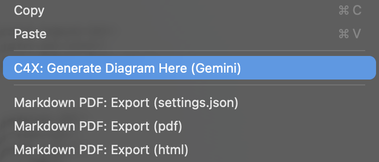
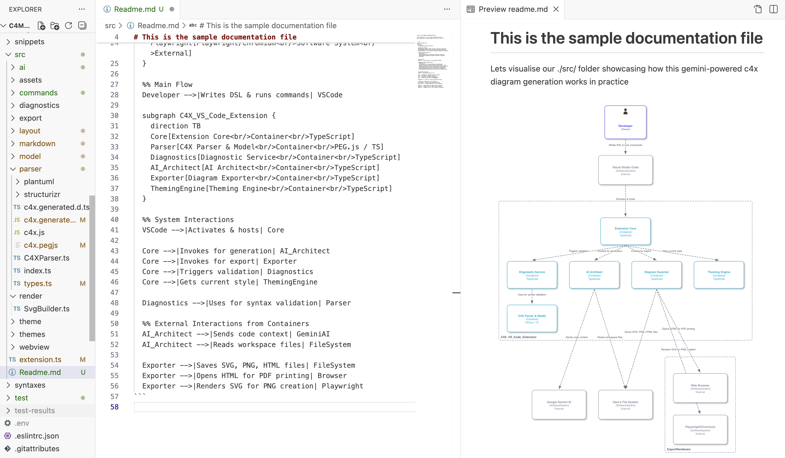
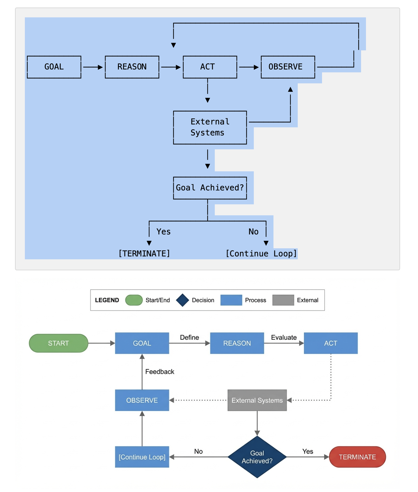
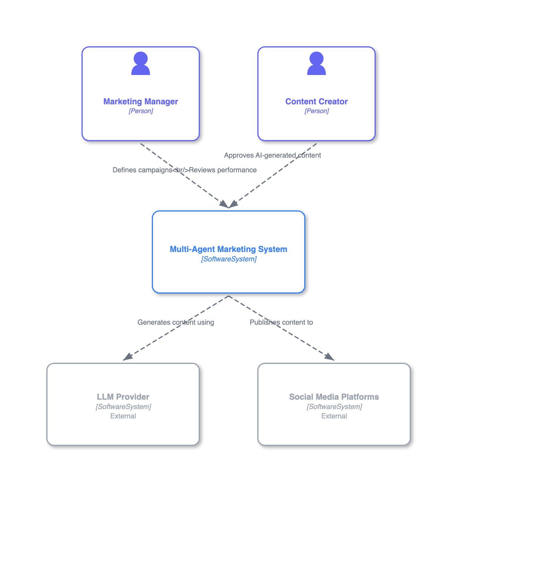
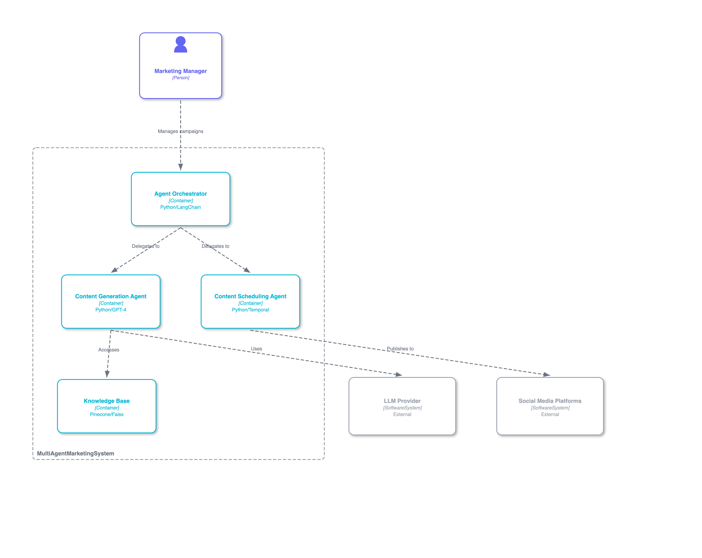

# C4X - C4 Model Diagrams for VS Code
>
> **Status (2026-03-03)**: ✅ **v1.3.0 STABLE** - Gemini 3.1 Pro + Visual Customization + 113 Examples


[](https://www.typescriptlang.org/)


> **Make C4 architectural diagrams as easy as getting AI to do this for you...** - Jaroslav

Fast, offline, Mermaid-inspired C4 diagrams with real-time preview and AI-powered generation - now with 113 validated examples and visual customization.

## 🎉 What's New in v1.3.0 (March 2026)

### 🚀 One-Click Diagram Generation

Right-click anywhere in your markdown files and instantly generate C4 diagrams:



**How it works**:
1. Right-click in any `.md` file
2. Select **"C4X: Generate Diagram Here (Gemini)"**
3. Choose your C4 level (C1: System Context, C2: Container, C3: Component)
4. AI-generated diagram appears at your cursor as a PNG image

### 🎨 Visual Customization & Enhanced AI

- **5 Visual Presets**: Default, Dark, Light, Pastel, Corporate - or define your own custom style
- **Layout Control**: Balanced, Compact, or Spacious spacing
- **Nano Banana 2**: Upgraded to `gemini-3.1-flash-image-preview` (4K support, better text rendering)
- **Gemini 3.1 Pro**: 2x reasoning improvement with `gemini-3.1-pro-preview` as default
- **Any Model Support**: Configure any Gemini model ID - no dropdown restrictions
- **Smart Fallback**: Automatically elevates to best available model on failure
- **Self-Validation**: AI auto-corrects syntax errors with 3 retry attempts

### 📚 Rich Example Library (113 Validated Diagrams)

**16 comprehensive sample files** covering production-ready patterns:
- Event-Driven Architecture (EventBridge, SQS, async messaging)
- Serverless Pipelines (Lambda, Step Functions, S3 triggers)
- OAuth 2.0 Authentication (PKCE, dynamic flows, token validation)
- Healthcare HIPAA Systems (HL7 FHIR, audit logging)
- GraphQL APIs (DataLoader, N+1 problem, federation)
- gRPC Microservices (Istio service mesh, Protocol Buffers)

> **All examples are 100% validated** - ready to learn from and use!

### 🔌 Developer Experience

- **MCP Validator**: Model Context Protocol server for external AI assistants (Claude, Cursor, Windsurf)
- **Comprehensive Guidelines**: `docs/C4X-GENERATION-GUIDELINES.md` for advanced AI prompting
- **Improved Layouts**: AI generates tidy, well-aligned, visually coherent diagrams

---

## ✨ Features

### 🚀 Core Capabilities
- ⚡ **Instant Preview** - Sub-50ms rendering for 30-node diagrams
- 🔍 **Real-time Validation** - Syntax highlighting and error reporting as you type
- 📝 **Markdown Integration** - Render ```c4x blocks directly in README files
- 🎨 **5 Built-in Themes** - Classic, Modern, Muted, High Contrast, Auto
- 📤 **Export** - SVG, PNG, PDF with theme preservation
- 🔒 **Secure & Offline** - Zero dependencies, no CDN, CSP-compliant
- 🧩 **1500+ Icons** - AWS, Azure, GCP with IntelliSense autocomplete
- ⚡ **Lightning Fast** - 0.15ms activation (99.9% faster than 200ms target)

### 🤖 AI-Powered Generation (Gemini 3.1 Pro)
- 🧠 **Code → Diagram**: Analyzes workspace files (.ts, .java, .py) to create accurate C4 models
- ✍️ **Text → Diagram**: Turn notes, ASCII art, user stories into diagrams
- 🖼️ **Right-Click Generation**: "Generate Diagram Here" for instant visual diagrams at cursor
- 🎨 **Style Customization**: 5 visual presets + custom grounding context
- 🎯 **Smart Layouts**: Auto-detects flow vs hierarchy orientation
- ✅ **Self-Correcting**: Validates & auto-fixes syntax errors (3 retry attempts)
- 🏢 **Enterprise Ready**: Supports Vertex AI keys for zero-data retention

> **[📘 Gemini AI Guide](./docs/GEMINI_GUIDE.md)** | **[📘 Visual Diagram Guide](./docs/DIAGRAM-WITH-GEMINI-IMAGE.md)** | **[📘 Advanced Guidelines](./docs/C4X-GENERATION-GUIDELINES.md)**

### 📚 Rich Learning Resources
- 📖 **113 Validated Examples**: Production-ready patterns in `/samples` directory
- 🎓 **16 Comprehensive Guides**: Event-driven, serverless, OAuth2, healthcare, GraphQL, gRPC
- 🔌 **MCP Integration**: Validator server for Claude, Cursor, and other AI assistants
- 📘 **Expert Guidelines**: C4X-GENERATION-GUIDELINES.md for advanced AI prompting



### 🎥 Watch 30s Demo - Build Diagrams with Gemini AI
[](https://youtu.be/qR1bbctj2rQ)

### 🎨 Rich Icon Integration (v1.1.9)
Visualize real-world architectures with **AWS, Azure, GCP, and React** icons using the simple `$sprite` syntax.


> **[📘 View Full Icon Guide & Examples](./docs/EXAMPLES-with-ICONS.md)**

### 🖼️ Visual Diagram Generation (v1.2.1 Preview)
Generate **presentation-ready PNG diagrams** directly from text using `gemini-3-pro-image-preview` - no DSL syntax required!
- **Generate from Selection**: Highlight any text (ASCII art, notes, requirements) and run `C4X: Diagram from Selection`.
- **Smart Layouts**: Automatically switches between Horizontal (for flows) and Vertical (for hierarchies).
- **Styles**: Enforces official C4 colors and shapes.



*Example: PNG Flow diagram from Selection - generated from another ASCII graphic*

> **[📘 Visual Diagram Guide](./docs/DIAGRAM-WITH-GEMINI-IMAGE.md)**

## 🚀 Quick Start

### Installation

**From VS Code Marketplace** (Recommended):

1. Open VS Code
2. Press `Ctrl+Shift+X` (or `Cmd+Shift+X` on Mac)
3. Search for "C4X"
4. Click "Install"

**From Command Line**:

```bash
code --install-extension jpantsjoha.c4x
```

### Usage

1. **Create a C4X file**: `banking-system.c4x`
2. **Write your diagram**:

   ```c4x
   %%{ c4: system-context }%%
   graph TB

   Customer[Customer<br/>Person]
   Banking[Banking System<br/>Software System]
   Email[Email System<br/>Software System<br/>External]

   Customer -->|Uses| Banking
   Banking -->|Sends notifications| Email
   ```

3. **Open preview**: Press `Ctrl+K V` (or `Cmd+K V` on Mac)
4. **See instant results**: Your diagram renders in < 50ms!

That's it! No Java, no servers, no configuration needed.

### Markdown Integration

You can embed C4X diagrams directly in your markdown files (e.g., `README.md`, `ARCHITECTURE.md`).

````text
# My Architecture

Here is the system context:

```c4x
%%{ c4: system-context }%%
graph TB
    User[User<br/>Person]
    System[My System<br/>Software System]
    User -->|Uses| System
```
````

The extension will automatically render this code block as a visual SVG diagram in the VS Code Markdown Preview.

## 📚 Learning & Examples

### 🎓 Rich Example Library (113 Validated Diagrams)

Explore **16 comprehensive sample files** in the `/samples` directory covering real-world production architectures:

**📁 `/samples/advanced/`**
- **Event-Driven Architecture**: EventBridge, SQS, async messaging, dead letter queues
- **Serverless Data Pipeline**: Lambda, S3 triggers, Step Functions, DynamoDB
- **OAuth 2.0 Authentication**: PKCE flow, JWT validation, token introspection
- **Domain-Driven Design**: Bounded contexts, aggregates, domain events

**📁 `/samples/container/`**
- **gRPC Microservices**: Istio service mesh, Protocol Buffers, Envoy sidecars
- **Kafka Event Streaming**: Producers, consumers, topics, consumer groups
- **CDC Data Pipeline**: Debezium, change data capture, stream processing

**📁 `/samples/component/`**
- **GraphQL API Gateway**: DataLoader pattern, N+1 problem solution, federation
- **REST API Design**: Controllers, services, repositories, CQRS pattern

**📁 `/samples/real-world/`**
- **Healthcare Patient Management**: HIPAA-compliant, HL7 FHIR, audit logging
- **E-Commerce Platform**: Order processing, inventory, payment integration
- **Trading Platform**: Real-time market data, WebSockets, order matching

**📁 `/samples/cloud/`**
- **AWS Multi-Region**: S3, DynamoDB global tables, CloudFront distribution
- **Azure Microservices**: AKS, Service Bus, Cosmos DB, API Management
- **GCP Serverless**: Cloud Run, Pub/Sub, Firestore, Cloud Functions

> **✅ 100% Validated** - All 113 diagrams are syntax-correct and render perfectly!

### 📖 Documentation & Guides

*   [**Example Gallery**](./docs/EXAMPLES.md): Banking, Microservices, AI Agents
*   [**Cloud Icons**](./docs/EXAMPLES-with-ICONS.md): AWS, Azure, GCP sprites with autocomplete
*   [**Visual Diagrams**](./docs/DIAGRAM-WITH-GEMINI-IMAGE.md): PNG generation with Nano Banana 2
*   [**C4X Generation Guidelines**](./docs/C4X-GENERATION-GUIDELINES.md): Advanced AI prompting & best practices
*   [**Layout Guide**](./docs/EXAMPLES-LAYOUT.md): TB vs LR, spacing control
*   [**Syntax Reference**](./docs/c4x-syntax.md): Complete DSL specification

### Featured Example: Multi-Agent Marketing System

**C1 - System Context**: High-level interactions between users, AI agents, and external services



**C2 - Container Diagram**: Internal architecture of the Multi-Agent platform



---

## 🧠 Gemini AI Architect (Setup)

> **📘 Full Guide**: See [docs/GEMINI_GUIDE.md](./docs/GEMINI_GUIDE.md) for advanced usage, prompt engineering tips, and troubleshooting.

**1. Get an API Key**
- **For Personal Projects**: Get a free key from [Google AI Studio](https://aistudio.google.com/). *(Note: Data may be used for training)*.
- **For Enterprise/Work**: Create a key in your **Google Cloud Console** (Vertex AI). *(Note: Compliant with GCP data privacy terms)*.

**2. Authentication**
- **Option A (Interactive)**: Right-click any markdown file -> `C4X: Generate Diagram`. If no key is found, paste it when prompted.
- **Option B (Settings)**: Set `"c4x.ai.apiKey": "YOUR_KEY"` in VS Code settings.

**3. AI Model Configuration (v1.3.0)**

C4X defaults to `gemini-3.1-pro-preview` with smart fallback. You can use **any Gemini model** your API key supports:

```json
{
  "c4x.ai.model": "gemini-3.1-pro-preview"
}
```

| Model | Use Case | Notes |
|-------|----------|-------|
| `gemini-3.1-pro-preview` | **Default** - Best reasoning, 1M context | Recommended |
| `gemini-3-flash-preview` | Fast iteration, free tier available | Good for rapid prototyping |
| `gemini-2.5-pro` | Stable, battle-tested | Sunset June 2026 |
| `gemini-2.5-flash` | Cost-effective | Sunset June 2026 |

**Custom Models**: Enter any valid Gemini model ID in settings. New models work immediately without an extension update.

**Smart Fallback**: If your chosen model fails, C4X automatically tries `gemini-3.1-pro-preview` (or `gemini-3-flash-preview` if already on 3.1-pro).

**Self-Validation**: All AI-generated diagrams are automatically validated using the C4X parser. If syntax errors are detected, the model self-corrects and retries (up to 3 attempts).

**4. Image Model Configuration (v1.3.0)**

For visual PNG diagram generation (Alt+V), C4X uses Nano Banana 2 by default. You can override with any Gemini image model:

```json
{
  "c4x.ai.imageModel": "gemini-3.1-flash-image-preview"
}
```

| Image Model | Use Case | Features |
|-------------|----------|----------|
| `gemini-3.1-flash-image-preview` | **Default** - Nano Banana 2 | 4K upscaling, better text rendering, $67/1k images ⚡ |
| `gemini-3-pro-image-preview` | Nano Banana Pro | Highest quality, best for production assets |
| `gemini-2.5-flash-image` | Previous Flash | Legacy model |

**Benefits of Nano Banana 2**:
- **4K Support**: Upscales to 400,000 pixels
- **Better Text**: More accurate text rendering in diagrams
- **Subject Consistency**: Maintains up to 5 characters and 14 objects
- **Cost Effective**: Pro quality at Flash pricing

**5. Visual Customization (v1.3.0)**

Customize the appearance of PNG diagrams with presets and fine-grained control:

```json
{
  "c4x.ai.visualPreset": "dark",           // Visual style preset
  "c4x.ai.layoutPreference": "spacious",   // Layout spacing
  "c4x.ai.visualGroundingContext": ""      // Custom style override
}
```

**Visual Presets**:

| Preset | Description | Use Case |
|--------|-------------|----------|
| `default` | Clean white background, standard C4 colors | Professional documentation |
| `dark` | Dark background, neon accents, high contrast | Presentations, dark-theme slides |
| `light` | Bright white, sharp edges | Print-ready, high contrast |
| `pastel` | Soft colors, rounded corners | Creative, gentle aesthetic |
| `corporate` | Grey-blue palette, sharp edges | Business presentations |

**Layout Preferences**:

| Preference | Description |
|------------|-------------|
| `balanced` | Standard spacing (default) |
| `compact` | Tight spacing, fits more elements |
| `spacious` | Generous padding, maximum readability |

**Custom Style Override**:
Use `visualGroundingContext` for complete control (overrides presets):
```json
{
  "c4x.ai.visualGroundingContext": "Cyberpunk aesthetic, neon purple/cyan, transparent background, glowing edges"
}
```

**C4 Color Palette Enforcement**:
C4X strictly enforces official C4 Model colors to ensure consistency:
- **Person**: `#08427B` (Dark Blue)
- **System**: `#1168BD` (Blue)
- **External**: `#999999` (Grey)
- **Container**: `#438DD5` (Light Blue)
- **Component**: `#85BBF0` (Lighter Blue)

*Note: Green/Red/Yellow are reserved for status indicators only.*

## 🔌 C4X MCP Server (Model Context Protocol)

C4X includes a built-in **MCP (Model Context Protocol) Server** that provides validation and grounding resources for external AI assistants.

### 🛠️ Available Tools & Resources

**`validate_c4x` Tool**:
- Validates C4X syntax before writing to files
- Identifies syntax errors, invalid element types, structural issues
- Returns precise line/column numbers for auto-correction
- Ensures C4 Model compliance

**MCP Resources**:
- `c4x://guidelines` - C4X Generation Guidelines (best practices, patterns)
- `c4x://examples/event-driven` | `c4x://examples/serverless` | `c4x://examples/oauth2` | `c4x://examples/healthcare` | `c4x://examples/graphql` | `c4x://examples/grpc` - Production-ready examples
- `c4x://syntax` - Complete DSL syntax reference

### 📝 Configuration

Add to your AI Assistant's MCP config (e.g., `cline_mcp_settings.json`, Claude Desktop `claude_desktop_config.json`):

```json
{
  "mcpServers": {
    "c4x-validator": {
      "command": "node",
      "args": ["/path/to/c4x-vscode-extension/out/mcp/c4x-mcp-server.js"]
    }
  }
}
```

**Supported Clients**: Claude Desktop, Cursor, Windsurf, Cline, any MCP-compatible AI assistant

### 💡 Use Cases

- **Pre-validation**: AI assistants validate diagrams before writing to files
- **Grounding**: Access to 113 examples and best practices for diagram generation
- **Self-correction**: Automatic syntax error detection and fixing

## 📖 C4X-DSL Syntax Guide

### Elements

```text
ElementID[Label<br/>Type<br/>Tags]
```

**Supported Types**:

- `Person` - Users of the system
- `Software System` - High-level software systems
- `Container` - Applications, services, databases
- `Component` - Code-level components

**Example**:

```c4x
Admin[Administrator<br/>Person]
API[Payment API<br/>Software System]
DB[User Database<br/>Container<br/>Internal]
```

### Elements with Icons (Function Syntax)

To use the 1500+ built-in icons, use the function-call syntax. **IntelliSense** will autocomplete icon names when you type `$sprite="`.
*   **Standard**: `$sprite="aws-s3-bucket"`
*   **Namespace (New)**: `$sprite="c4xicons.aws.s3-bucket"` (Auto-resolves to correct icon)

```c4x
Container(WebApp, "Web App", "React", $sprite="react")
ContainerDb(DB, "Database", "PostgreSQL", $sprite="c4xicons.aws.rds")
Container(S3, "Storage", "AWS S3", $sprite="c4xicons.aws.s3-bucket")
```

### Relationships

```text
%% Uses (Dashed)
FromID -->|Label| ToID
%% Async (Dashed)
FromID -.->|Label| ToID
%% Sync / Strong (Solid)
FromID ==>|Label| ToID
```

**Example**:

```c4x
User[User<br/>Person]
Dashboard[Reporting Dashboard<br/>Container]
API[Reporting API<br/>Container]
Database[Reporting Database<br/>Container]

User -->|Views reports| Dashboard
Dashboard -.->|Fetches data| API
API ==>|Queries| Database
```

### Boundaries / Subgraphs

Group elements into systems or containers using subgraphs.

```text
subgraph BoundaryId {
    Element1[Label<br/>Type]
    Element2[Label<br/>Type]
}
```

**Example**:

```c4x
graph TB
    User[User<br/>Person]

    subgraph BankingSystem {
        WebApp[Web App<br/>Container]
        Database[DB<br/>Container]
    }

    User -->|Uses| WebApp
    WebApp ==>|Reads/Writes| Database
```

### View Types

```text
%% C1 - System Context
%%{ c4: system-context }%%
%% C2 - Container (coming soon)
%%{ c4: container }%%
%% C3 - Component (coming soon)
%%{ c4: component }%%
```

## 🎨 Themes

Choose from 5 built-in themes to match your documentation style:

| Theme | Description | Use Case |
|-------|-------------|----------|
| **Classic** | Official C4 Model colors (Simon Brown spec) | Standard C4 documentation |
| **Modern** | Vibrant colors with rounded corners | Presentations, modern docs |
| **Muted** | Grayscale minimalist | Professional reports, B&W printing |
| **High Contrast** | WCAG AAA compliant (7:1 ratio) | Accessibility, readability |
| **Auto** | Adapts to VS Code light/dark theme | Match your editor theme |

**Change Theme**:

- Command Palette: `C4X: Change Theme`
- Settings: `"c4x.theme": "modern"`

## 📤 Export Diagrams

Export your diagrams to SVG or PNG with theme preservation:

**Export Commands**:

- `C4X: Export SVG` - Vector format for editing (Figma, Sketch, Adobe Illustrator)
- `C4X: Export PNG` - Raster format for documentation and presentations
- `C4X: Copy SVG to Clipboard` - Quick paste into other applications

**Features**:

- ✅ Theme preservation (exported diagrams match your selected theme)
- ✅ High-quality rendering (no pixelation in SVG)
- ✅ Design tool compatibility (Figma, Sketch tested)
- ✅ Small file sizes (~20-50KB for typical diagrams)

## 📋 Commands

| Command | Shortcut | Description |
|---------|----------|-------------|
| `C4X: Open Preview` | `Ctrl+K V` (Mac: `Cmd+K V`) | Open live preview panel |
| **`C4X: Generate Diagram Here (Gemini)`** | - | **Generate AI diagram at cursor position** |
| `C4X: Generate from Selection` | `Alt+V` | Generate PNG from text selection |
| `C4X: Generate from Workspace` | - | Analyze code and create C4 model |
| `C4X: Export SVG` | - | Export diagram to SVG file |
| `C4X: Export PNG` | - | Export diagram to PNG file |
| `C4X: Copy SVG to Clipboard` | - | Copy SVG to clipboard |
| `C4X: Change Theme` | - | Switch between 5 built-in themes |

## ⚡ Performance

Exceeds all targets by 72-99%:

| Metric | Target | Achieved | Status |
|--------|--------|----------|--------|
| **Activation Time** | < 200ms | **0.15ms** | ✅ 99.9% faster |
| **Bundle Size** | < 1MB | **386KB** | ✅ 63% under target |
| **C4X Parse** | < 50ms | **10ms avg** | ✅ 80% faster |
| **Preview Render** | < 250ms | **55ms avg** | ✅ 78% faster |
| **Full Pipeline** | < 300ms | **55ms avg** | ✅ 82% faster |

**Tested with**: 30-node diagrams (typical real-world size)

## 🛠️ Configuration

### Settings

Configure C4X in your VS Code settings (`Ctrl+,` or `Cmd+,`):

```json
{
  // Choose your preferred theme
  "c4x.theme": "classic",
  // Options: "classic", "modern", "muted", "high-contrast", "auto"
}
```

### File Associations

C4X automatically recognizes these file extensions:

- `.c4x` - C4X-DSL (Mermaid-inspired syntax)

## 🏗️ Project Status

**Phase 1 (M0 - Scaffolding)**: ✅ Complete (v0.1.0)
**Phase 2 (M1 - C4X-DSL MVP)**: ✅ Complete (v0.2.0)
**Phase 3 (M2 - Themes & Export)**: ✅ Complete (v0.3.0)
**Phase 4 (M3 - Structurizr DSL)**: ⏳ Deferred to v1.2
**Phase 5 (M4 - PlantUML C4)**: ⏳ Deferred to v1.2

See [docs/STATUS.md](./docs/STATUS.md) for detailed roadmap.

## 🗺️ Roadmap

### v1.1.8 (December 2025) ✅ Gemini AI Release
- 🧠 **Gemini AI Integration** - Text-to-Diagram (Shipped)
  - **Generate from Code**: Workspace scanning (C1/C2/C3 support).
  - **Sketch-to-Code**: Create diagrams from text selections.
  - **Smart Layouts**: Auto-detection of Flow vs Hierarchy.
- 📐 **Advanced Layout Control** - Manual positioning overrides.

### v1.2.1 (December 2025) ✅ AI Model Upgrade + Visual Generation
- 🧠 **AI Model Upgrade** - Upgraded to `gemini-3-flash-preview` (3x faster)
- 🎨 **Visual Diagram Generation** - PNG diagrams via `gemini-3-pro-image-preview`.
- 🔄 **Self-Validation** - Auto-correction for AI-generated diagrams.
- **[📘 Visual Diagram Guide](./docs/DIAGRAM-WITH-GEMINI-IMAGE.md)**

### v1.3.0 (March 2026) ✅ Gemini 3.1 Pro + Custom Model Selection
- 🧠 **Gemini 3.1 Pro** - Default model upgraded to `gemini-3.1-pro-preview` (2x reasoning improvement).
- 🎛️ **Custom Model Selection** - Enter any Gemini model ID in settings — no more restrictive dropdown.
- 🔄 **Smart Fallback** - Automatic elevation to best available model on failure.
- 🗑️ **Removed sunset models** - `gemini-3-pro-preview` (sunset March 9, 2026) removed from defaults.

### v1.4.0 (Q2 2026) 🏗️ Advanced Integrations
- ⏳ **Structurizr DSL Support** - Native parsing of `.dsl` files.
- 🖼️ **Custom Local Icons** - Support for `$sprite="./assets/logo.png"`.
- 🔮 **Deployment Diagrams** - Visualize infrastructure (Nodes, Pods, Regions).
- 📦 **Workspace Diagnostics** - Dedicated panel for architecture health.

### v2.0.0 (Q3 2026) 🤖 Multi-Provider AI + Agentic Architecture
- 🧠 **Multi-Provider AI** - Support for Claude (Anthropic), OpenAI, and Gemini models.
- 🧠 **Agent Syntax** - First-class support for `AI_Agent`, `Memory`, `Tool`.
- 🛡️ **Architecture Analysis** - Automated detection of bottlenecks and security risks.
- ✨ **Generative Refactoring** - "Suggest improvements" for your architecture.

## 📚 Documentation

- [Contributing](./CONTRIBUTING.md) - Contribution guidelines

## 🤝 Contributing

Contributions welcome! We'd love your help to make C4X even better.

**Ways to contribute**:

- 🐛 Report bugs or suggest features via [GitHub Issues](https://github.com/jpantsjoha/c4x-vscode-extension/issues)
- 📝 Improve documentation or examples
- 🎨 Design new themes or icons
- 🧪 Write tests for edge cases
- ⚡ Performance optimizations

### ✅ Validation

To ensure that documentation diagrams are syntactically and semantically correct, use the provided validation script. This checks for parser errors, invalid relationships, and unsupported element types.

```bash
# Verify all markdown files in the repository
./scripts/validate_c4x.sh
```

See [CONTRIBUTING.md](./CONTRIBUTING.md) for detailed guidelines.

## 👤 More from the Author

Check out my other VS Code extension:

- **[Pine Script™ (v5)](https://marketplace.visualstudio.com/items?itemName=jpantsjoha.pine-script-v5)** - Syntax highlighting, snippets, and linting for TradingView's Pine Script.
  - [GitHub Repository](https://github.com/jpantsjoha/pinescript-vscode-extension)

## 📄 License

MIT License - see [LICENSE](./LICENSE) for details.

## 🙏 Acknowledgments

- [C4 Model](https://c4model.com/) by Simon Brown - The architectural modeling standard
- [Mermaid.js](https://mermaid.js.org/) - Inspiration for C4X-DSL syntax
- [Dagre.js](https://github.com/dagrejs/dagre) - Hierarchical graph layout engine

Read more about the [Story Behind C4X](./ABOUT.md).

---

**Made with [Gemini](https://blog.google/products/gemini/gemini-3/) ❤️ for architects who value simplicity** | [Report Issues](https://github.com/jpantsjoha/c4x-vscode-extension/issues) | [Star on GitHub](https://github.com/jpantsjoha/c4x-vscode-extension)
