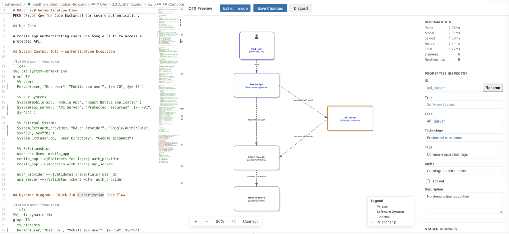
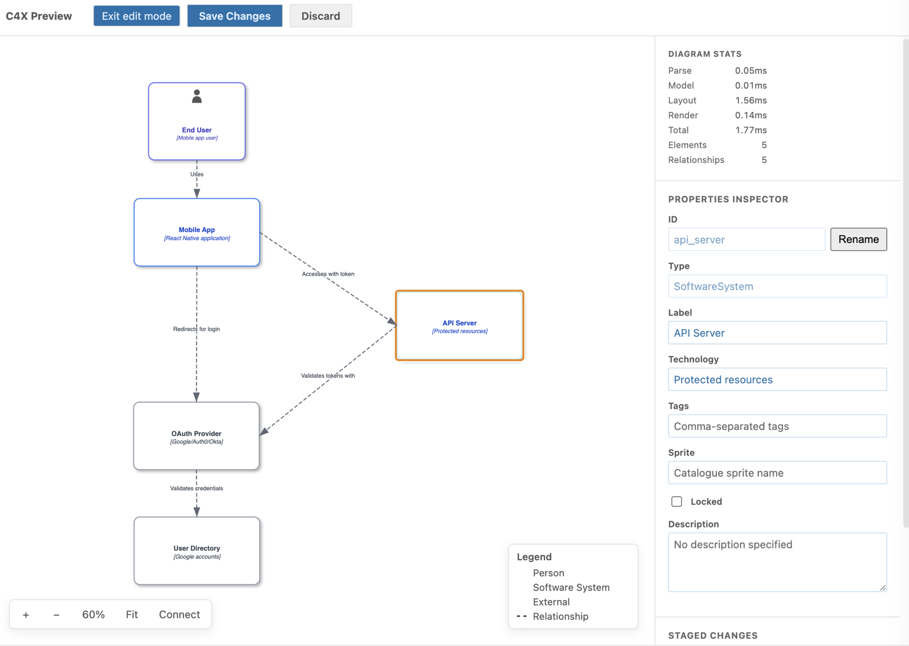
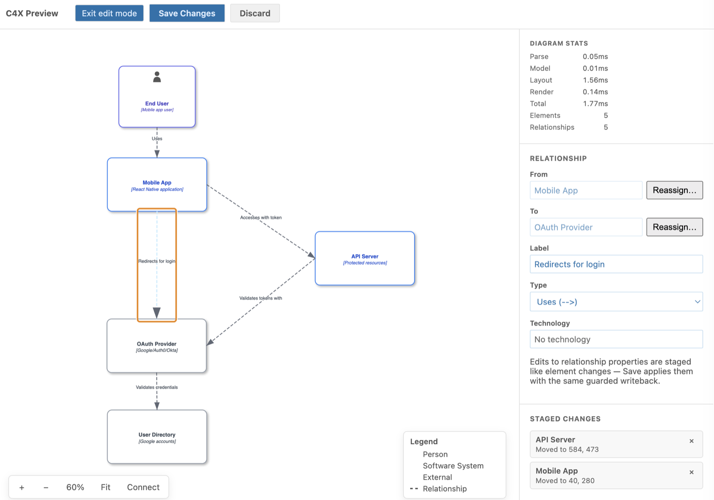
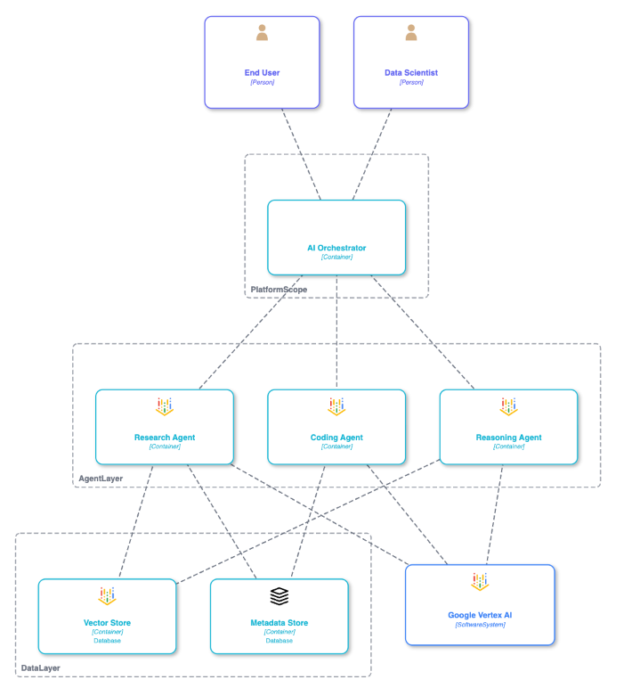

# C4X - C4 Model Diagrams for VS Code

[](https://marketplace.visualstudio.com/items?itemName=jpantsjoha.c4x)
[](https://open-vsx.org/extension/jpantsjoha/c4x)
[](https://marketplace.visualstudio.com/items?itemName=jpantsjoha.c4x)

[](https://www.typescriptlang.org/)


Fast, offline C4 architecture diagrams with a source-driven SVG preview and optional AI-powered generation via Google Gemini. Mermaid-inspired DSL, C4-compliant rendering, PNG export, and 1500+ cloud icons.

> **Trusted in production by thousands of developers** — installs and downloads are tracked live via the badges above ([VS Code Marketplace](https://marketplace.visualstudio.com/items?itemName=jpantsjoha.c4x) · [Open VSX](https://open-vsx.org/extension/jpantsjoha/c4x)).



## Watch

| [30s tour](https://youtu.be/qR1bbctj2rQ) | [Editing a diagram by dragging it](https://youtu.be/SjSg5LAIUwg) |
|---|---|
| [](https://youtu.be/qR1bbctj2rQ) | [](https://youtu.be/SjSg5LAIUwg) |

## New in v1.6: the Visual C4 Editor

Diagrams stay text. You can now edit them by dragging.

> **v1.6.2 highlights** · Drag an element and it stays where you drop it · Diagrams open centred and ready to edit · Edit, Save and Discard sit together at the top left

- **Lay a diagram out by hand**: Drag elements until the picture reads the way you would draw it on a whiteboard, then save. Auto-layout gets you started; you decide where things go
- **Edit an element without hunting through the source**: Click it and change its name, technology, description, tags or icon in the inspector. Rename it and every relationship that mentions it is updated too
- **Draw a relationship**: Pick two elements and name the connection. Point an existing arrow somewhere else when the design moves on
- **Group things that belong together**: Move and resize a boundary and its contents travel with it
- **See what you are about to change**: Every edit is listed, reversible one by one, and shown as a diff against your source before you save. Nothing is written until you say so
- **Keep the source trustworthy**: A save that cannot be applied cleanly is rolled back rather than half-written, and you are warned if the file changed underneath you. Structurizr and PlantUML files are never rewritten; their layout is kept alongside them
- **Edit the diagrams already in your docs**: Open the editor straight from a `c4x` block in any Markdown file, so the architecture in your README stays as current as the code
- **Work without a mouse**: Every gesture has a keyboard equivalent, announced for screen readers

### The editor

| | |
|---|---|
|  |  |
| Select an element to edit its properties | Select a relationship to re-target or relabel it. Every change is staged before it is saved |

## New in v1.4.0

- **PNG export**: Canvas-based at 1x/2x/4x resolution, no Chromium needed
- **C4 Standard theme**: Official filled-box convention as the new default
- **Auto-layout**: LR for small diagrams, TB for large
- **24 architecture pattern examples**: [CQRS, Saga, BFF, Hexagonal, IoT, CI/CD, Zero-Trust, and more](./docs/EXAMPLES-PATTERNS.md)
- **All C4 view levels documented**: [C1 through C4 + Dynamic diagrams](./docs/EXAMPLES-VIEWS.md)

## Features

- **Source-first Preview**: Open or refresh a deterministic SVG view from the supported diagram source
- **Visual editing**: Drag elements, edit properties, draw relationships; every change written back to your source
- **AI Generation (Gemini)**: Code-to-diagram, text-to-diagram, and visual PNG generation
- **All C4 Levels**: System Context, Container, Component, Deployment, and Dynamic views
- **6 Themes**: C4 Standard (default), Classic, Modern, Muted, High Contrast, Auto
- **Export**: PNG (1x/2x/4x), SVG, Copy SVG with theme preservation
- **1500+ Icons**: AWS, Azure, GCP with IntelliSense autocomplete (`$sprite` syntax)
- **Markdown Integration**: Render `c4x` blocks directly in README and architecture docs
- **Auto-Layout**: horizontal for small diagrams, vertical for large
- **Self-Correcting AI**: Parser-validated output with automatic retry and self-remediation
- **MCP Server**: Built-in validator for Claude, Cursor, and other AI assistants

## Quick Start

### Install

**VS Code Marketplace** (recommended): Search "C4X" in Extensions (`Cmd+Shift+X`) and install.

**Command line**: `code --install-extension jpantsjoha.c4x`

### Create a Diagram

1. Create a file `architecture.c4x`
2. Write your diagram:

```c4x
%%{ c4: system-context }%%
graph TB

Customer[Customer<br/>Person]
Banking[Banking System<br/>Software System]
Email[Email System<br/>Software System<br/>External]

Customer -->|Uses| Banking
Banking -->|Sends notifications| Email
```

1. Open preview: `Cmd+K V` (or `Ctrl+K V`)

No Java, no servers, no configuration needed.

### Embed in Markdown

````text
```c4x
%%{ c4: system-context }%%
graph TB
    User[User<br/>Person]
    System[My System<br/>Software System]
    User -->|Uses| System
```
````

The extension renders `c4x` code blocks as visual diagrams in VS Code's Markdown Preview.

## DSL Syntax

### Elements

```text
%% Bracket syntax
Admin[Administrator<br/>Person]
API[Payment API<br/>Software System<br/>External]

%% Function syntax (supports icons, technology, description)
Container(WebApp, "Web App", "React", $sprite="c4xicons.aws.elastic-beanstalk-application")
ContainerDb(DB, "Database", "PostgreSQL")
Person(User, "End User")
```

Types: `Person`, `Software System`, `Container`, `ContainerDb`, `Component`, `ComponentDb`, plus `*_Ext` variants for external elements.

### Relationships

```text
A -->|Label| B        %% Standard dependency
A ==>|Label| B        %% Synchronous / blocking
A -.->|Label| B       %% Asynchronous / event-driven
```

### Boundaries

```c4x
%%{ c4: container }%%
graph TB
    User[User<br/>Person]

    subgraph BankingSystem {
        WebApp[Web App<br/>Container]
        Database[DB<br/>Container]
    }

    User -->|Uses| WebApp
    WebApp ==>|Reads/Writes| Database
```

### View Types

```text
%%{ c4: system-context }%%      %% C1
%%{ c4: container }%%           %% C2
%%{ c4: component }%%           %% C3
%%{ c4: deployment }%%          %% C4
%%{ c4: dynamic }%%             %% Sequence/interaction
```

Full reference: [Syntax Guide](./docs/c4x-syntax.md)

## AI Generation (Gemini)

C4X uses Google Gemini to generate diagrams from code, text, or selections.

**Setup**: Get a free API key from [Google AI Studio](https://aistudio.google.com/) or use a [Google Cloud](https://cloud.google.com/) Vertex AI key for enterprise compliance. Keys are stored in VS Code's encrypted SecretStorage.

**Default model**: `gemini-3.5-flash`, with automatic failover to `gemini-3.1-pro-preview`. Set any Gemini model id in `c4x.ai.model`; retired preview ids are redirected to their replacements rather than failing.

| Command | What it does |
|---------|-------------|
| `C4X: Generate Diagram Here` | Generate C4X diagram at cursor from context |
| `C4X: Generate from Selection` (`Alt+V`) | Generate visual PNG from highlighted text |
| `C4X: Generate from Workspace` | Analyze code files and create C4 model |

All AI-generated diagrams are parser-validated with up to 3 self-correction retries.

Full guide: [Gemini AI Guide](./docs/GEMINI_GUIDE.md) | [Visual Diagram Guide](./docs/DIAGRAM-WITH-GEMINI-IMAGE.md)

## Icons

1500+ built-in cloud and technology icons with IntelliSense autocomplete.



```c4x
Container(S3, "Storage", "AWS S3", $sprite="c4xicons.aws.simple-storage-service-bucket")
ContainerDb(DB, "Database", "Cloud SQL", $sprite="c4xicons.gcp.cloudsql")
```

Full icon catalog: [Icons & Examples](./docs/EXAMPLES-with-ICONS.md)

## Export

| Command | Format | Notes |
|---------|--------|-------|
| `C4X: Export PNG` | PNG | 1x, 2x, or 4x resolution. Canvas-based, no Chromium. |
| `C4X: Export SVG` | SVG | Vector format for Figma, Sketch, Illustrator |
| `C4X: Copy SVG to Clipboard` | SVG | Quick paste into other apps |

Exported diagrams preserve your selected theme.

## Themes

| Theme | Description |
|-------|-------------|
| **C4 Standard** | Official filled-box convention (default) |
| Classic | White-fill with colored borders |
| Modern | Vibrant colors, rounded corners |
| Muted | Grayscale minimalist |
| High Contrast | WCAG AAA compliant |
| Auto | Adapts to VS Code light/dark |

Change via Command Palette (`C4X: Change Theme`) or settings (`"c4x.theme": "modern"`).

## Examples & Documentation

| Guide | Content |
|-------|---------|
| [Example Gallery](./docs/EXAMPLES.md) | Banking, Microservices, AI Agents |
| [All C4 View Levels](./docs/EXAMPLES-VIEWS.md) | C1-C4 + Dynamic, relationship types, database variants |
| [Architecture Patterns](./docs/EXAMPLES-PATTERNS.md) | CQRS, Event Sourcing, Saga, BFF, Hexagonal, IoT, CI/CD, and more |
| [Cloud Icons](./docs/EXAMPLES-with-ICONS.md) | AWS, Azure, GCP sprites with autocomplete |
| [Layout Guide](./docs/EXAMPLES-LAYOUT.md) | Direction control, nested layouts, manual positioning |
| [Ordering Guide](./docs/EXAMPLES-ORDERING.md) | Controlling element placement |
| [Visual Editing Status](./docs/features/visual-c4-editor.md) | Verified capability matrix, current how-to, and Known Limitations |
| [Visual C4 Editor Wiki](https://github.com/jpantsjoha/c4x-vscode-extension/wiki/Visual-C4-Editor) (in-repo source: [`wiki/Visual-C4-Editor.md`](./wiki/Visual-C4-Editor.md)) | v1.6 Visual C4 Editor overview — what ships today, what's planned, safety promises, try-it-locally steps |
| [Visual Diagrams](./docs/DIAGRAM-WITH-GEMINI-IMAGE.md) | AI-powered PNG generation |
| [Syntax Reference](./docs/c4x-syntax.md) | Complete DSL specification |
| [Generation Guidelines](./docs/C4X-GENERATION-GUIDELINES.md) | Advanced AI prompting |

## MCP Server

A C4X source checkout includes a tracked, self-contained Model Context Protocol server for AI assistant integration. It starts without loading packages from `node_modules`, so it remains reliable in iCloud-backed workspaces and clean clones. The server is distributed with the source repository, not the Marketplace VSIX.

```json
{
  "mcpServers": {
    "c4x-validator": {
      "command": "node",
      "args": ["/absolute/path/to/c4x-vscode-extension/mcp/c4x-mcp-server.bundle.cjs"]
    }
  }
}
```

For a trusted Codex project, use `.codex/config.toml`:

```toml
[mcp_servers.c4x-validator]
command = "node"
cwd = "/absolute/path/to/c4x-vscode-extension"
args = ["mcp/c4x-mcp-server.bundle.cjs"]
startup_timeout_sec = 10
tool_timeout_sec = 10
```

Restart the MCP client after changing its configuration. Maintainers can regenerate and verify the bundle and its `THIRD_PARTY_NOTICES.txt` file with `pnpm run build:mcp` and `pnpm run verify:mcp`.

**Tool**: `validate_c4x` validates syntax, returns line/column errors for auto-correction.
**Resources**: `c4x://guidelines`, `c4x://syntax`, `c4x://examples/*`

Works with Claude Desktop, Cursor, Windsurf, Cline, and any MCP-compatible client.

## Performance

| Metric | Target | Achieved |
|--------|--------|----------|
| Activation | < 200ms | **0.15ms** |
| Bundle Size | < 1MB | **386KB** |
| Parse | < 50ms | **10ms** |
| Preview Render | < 250ms | **55ms** |

These are historical v1.4 measurements from a 30-node fixture. Current development and release claims use the evidence gates recorded in [`STATUS.md`](./STATUS.md) and [`docs/ROADMAP.md`](./docs/ROADMAP.md).

## Roadmap

**Shipped**

- **v1.6** (August 2026): Visual C4 Editor: drag-to-edit with guarded writeback, connect mode, boundary reposition/resize, staged changes with source diff
- **v1.4.0** (May 2026): PNG export, auto-layout, C4-compliant renderer, model validation

**Deferred beyond v1.6**, and openly so: an element palette, and delete for elements and relationships. Both are authoring gestures whose writeback consequences deserve their own release rather than a corner of this one.

Known limitations are tracked in the [Visual Editing Status](./docs/features/visual-c4-editor.md) matrix. Full roadmap: [docs/ROADMAP.md](./docs/ROADMAP.md)

## Contributing

Contributions welcome via [GitHub Issues](https://github.com/jpantsjoha/c4x-vscode-extension/issues) and pull requests. See [CONTRIBUTING.md](./CONTRIBUTING.md) for guidelines.

## More from the Author

- **[Pine Script (v5)](https://marketplace.visualstudio.com/items?itemName=jpantsjoha.pine-script-v5)**: Syntax highlighting, snippets, and linting for TradingView's Pine Script

## License

MIT. See [LICENSE](./LICENSE).

## Acknowledgments

- [C4 Model](https://c4model.com/) by Simon Brown
- [Mermaid.js](https://mermaid.js.org/): DSL syntax inspiration
- [Dagre](https://github.com/dagrejs/dagre): Graph layout engine

---

**Made with [Gemini](https://blog.google/products/gemini/gemini-3/) for architects who value simplicity** | [Report Issues](https://github.com/jpantsjoha/c4x-vscode-extension/issues) | [Star on GitHub](https://github.com/jpantsjoha/c4x-vscode-extension)
