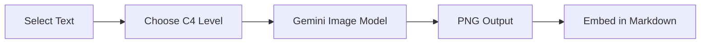

# Visual C4 Diagrams with Gemini Image (Preview)

> **Status**: 🧪 Preview Feature (v1.2.0+)
> **Model**: `gemini-3-pro-image-preview`

Generate **presentation-ready C4 diagrams as PNG images** directly from text descriptions using Google's Gemini Image model.

## Overview

C4X offers two approaches to diagram generation:

| Approach | Output | Best For |
|----------|--------|----------|
| **C4X-DSL (Default)** | SVG via parser | Iterative editing, version control, consistency |
| **Visual Generation (Preview)** | PNG via AI | Presentations, quick mockups, rich visuals |

## How It Works



1. **Select context** in your markdown file (architecture description, notes, etc.)
2. **Right-click** → "C4X: Preview - Visual Diagram (Gemini)"
3. **Choose C4 level** (or let AI auto-detect)
4. **Receive PNG** saved to your folder and embedded in markdown

## Key Differences

### C4X-DSL (Default) - Code-Based

```c4x
%%{ c4: system-context }%%
graph TB
    User[Customer<br/>Person]
    System[Banking System<br/>Software System]
    User -->|Uses| System
```

**Pros:**
- ✅ Deterministic output (same input = same result)
- ✅ Version control friendly (text diffs)
- ✅ Iteratively editable
- ✅ Works offline
- ✅ Instant rendering (~50ms)

**Cons:**
- ❌ Requires learning DSL syntax
- ❌ Limited visual customization

### Visual Generation (Preview) - AI-Based

```text
"Create a C4 System Context showing a Customer 
using an Online Banking System that connects 
to an Email System for notifications."
```

**Pros:**
- ✅ No syntax knowledge required
- ✅ Rich, presentation-ready visuals
- ✅ Automatic styling and layout
- ✅ Smart C4 level detection

**Cons:**
- ❌ Non-deterministic (slight variations between runs)
- ❌ Requires API key and network
- ❌ Not editable after generation
- ❌ Higher token cost

## Visual Style Reference

The AI generates diagrams following the official C4 Model specification:

| Element | Color | Shape |
|---------|-------|-------|
| Person | Dark Blue (#08427B) | Stick figure + rectangle |
| Software System | Blue (#1168BD) | Rounded rectangle |
| External System | Grey (#999999) | Rounded rectangle |
| Container | Light Blue (#438DD5) | Rounded rectangle |
| Database | Light Blue | Cylinder |
| Component | Lighter Blue (#85BBF0) | Rounded rectangle |

## Visual Guidelines & Layout

The AI applies strict C4X design rules to ensure professional quality:

### Strict Guidelines
- **Multimodal Grounding**: Injects explicit reference images (Diagram + Key) to force style compliance.
- **Visual Separation**:
  - **Nodes (Systems/Apps)**: Filled Blue/Grey boxes.
  - **Boundaries (Clusters)**: **Transparent** with Dashed Lines. Never filled.

### Smart Layout Algorithm
The feature automatically decides the layout direction based on diagram complexity:

1. **Small Diagrams (≤ 4 Nodes)**:
   - Layout: **Horizontal (Left-Right)**
   - User Position: **Left**
   - Best for: Linear flows, simple sequences.

2. **Large Diagrams (≥ 5 Nodes)**:
   - Layout: **Vertical (Top-Bottom)**
   - User Position: **Top**
   - Best for: Hierarchies, complex systems.

3. **Sequential Flow**:
   - If your text describes a linear sequence (e.g., `A -> B -> C`), the AI strictly follows that direction.

## Smart Level Detection

The AI automatically detects the appropriate C4 level from your context:

| Keywords | Detected Level |
|----------|----------------|
| "users", "customers", "actors", "external systems" | **C1 - System Context** |
| "services", "databases", "APIs", "applications" | **C2 - Container** |
| "classes", "modules", "controllers", "functions" | **C3 - Component** |
| "nodes", "pods", "regions", "infrastructure" | **Deployment** |

## Usage Example

### Input (Selected Text)
```markdown
Our DeFi platform consists of:
- Web Dashboard (React) for retail traders
- Trading API (Node.js) for order management  
- Order Matching Engine (Rust) for high-performance matching
- PostgreSQL database for persistence
- Redis cache for sessions
- Integration with Ethereum blockchain for smart contracts
```

### Output
A professional C4 Container diagram PNG showing all components with proper styling, arrows, and a legend.

## Configuration

### Prerequisites
- Gemini API Key (see [Gemini AI Guide](./GEMINI_GUIDE.md))
- Network connection

### Settings
```json
{
  "c4x.ai.apiKey": "YOUR_API_KEY",
  "c4x.ai.model": "gemini-3-flash-preview"  // For DSL generation
}
```

> **Note**: Visual generation always uses `gemini-3-pro-image-preview` regardless of the model setting.

## Test Script

Verify the image model works with your API key:

```bash
npx ts-node scripts/test-gemini-image.ts
```

Expected output:
```
✅ gemini-3-pro-image-preview is available
✅ Image generated: ~500KB PNG
```

## Related Documentation

- [Gemini AI Guide](./GEMINI_GUIDE.md) - API key setup and general AI features
- [C4X-DSL Syntax](./c4x-syntax.md) - Code-based diagram syntax
- [Examples Gallery](./EXAMPLES.md) - Sample C4 diagrams
- [ADR 013: Visual Diagram Generation](./adrs/013-gemini-visual-diagram-generation.md) - Architecture decision

## Limitations

1. **Preview Status**: This feature uses a preview model and may have rate limits
2. **No Editing**: Generated PNGs cannot be iteratively refined like DSL code
3. **Consistency**: Slight visual variations between generations are expected
4. **Cost**: Image generation may consume more API quota than text generation
