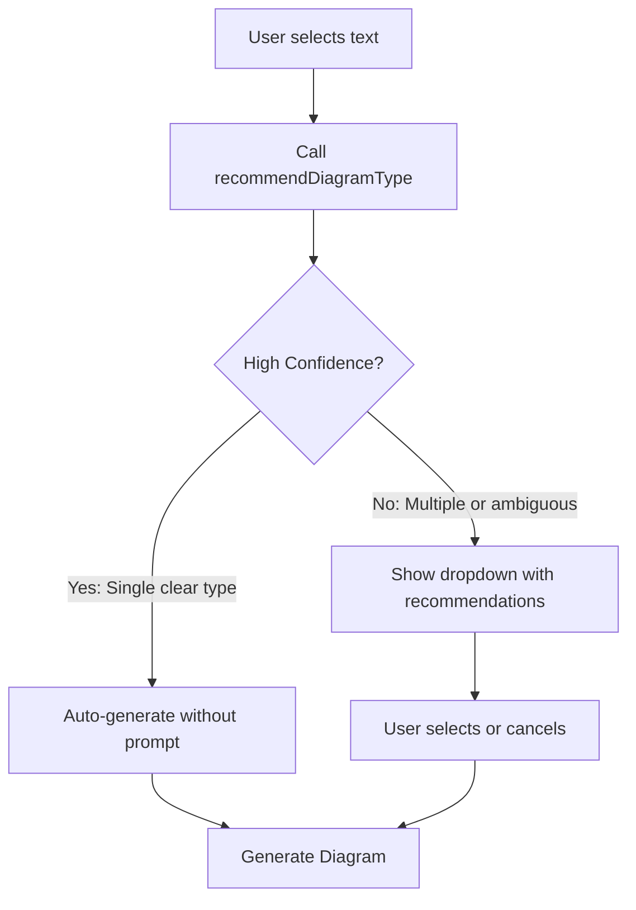

# ADR 014: Auto-Detect C4 Level for Diagram Generation

**Date**: 2025-12-20
**Status**: Accepted

## Context

Currently, when users right-click to generate a C4X diagram from a text selection, the extension shows a dropdown menu requiring them to manually select the diagram type (C1 System Context, C2 Container, C3 Component, or Custom).

User feedback indicates this is an unnecessary friction point:
> "The model should be smart enough to inspect the context selection and generate the appropriate level diagram automatically."

The extension already has a `recommendDiagramType()` method in `GeminiService.ts` that analyzes text and returns recommended C4 levels. However, this recommendation is only used to sort the dropdown items (starring recommendations) rather than auto-selecting.

## Decision

Implement **Smart Auto-Detection** that bypasses the dropdown when the AI has high confidence:

### New Flow

### Confidence Detection

The AI will return a confidence signal:

| Signal | Action |
|--------|--------|
| Single type returned (e.g., `["C2"]`) | **Auto-select** - proceed without dropdown |
| Multiple types (e.g., `["C1", "C2"]`) | Show dropdown with starred recommendations |
| Error or timeout | Show dropdown without recommendations |

### Keyword-Based Heuristics

Fallback detection based on content keywords:

| Keywords | Detected Level |
|----------|----------------|
| "users", "customers", "actors", "external systems", "third-party" | **C1 - System Context** |
| "services", "databases", "APIs", "containers", "microservices", "HTTP", "REST" | **C2 - Container** |
| "classes", "modules", "functions", "controllers", "methods", "imports" | **C3 - Component** |

### Safety Escape

- Add a `c4x.ai.alwaysAskLevel` setting (default: `false`)
- If true, always show the dropdown even with high confidence
- Users who prefer manual control can enable this

## Implementation

### Phase 1: Smart Skipping (Minimal Change)
1. Modify `GenerateDiagramCommand.ts` to check recommendation result
2. If `types.length === 1`, skip dropdown and use that type
3. If `types.length > 1`, show dropdown with recommendations (current behavior)

### Phase 2: Confidence Scoring (Future)
1. Enhance `recommendDiagramType()` to return `confidence: 0.0-1.0`
2. Auto-select when `confidence >= 0.8`
3. Log analytics on auto-detection accuracy

## Consequences

### Positive
- **Faster UX**: One-click diagram generation for clear contexts
- **Lower cognitive load**: Users don't need to understand C4 levels
- **Smart defaults**: Expert users already know what to expect

### Negative
- **Occasional mismatch**: AI may choose wrong level for ambiguous content
- **Less control**: Power users may prefer explicit selection

### Mitigation
- Always show progress with "Generating C2 Container Diagram..." message
- Easy re-generation with different level via context menu
- Settings option to restore dropdown behavior

## Related

- **ADR 013**: Visual Diagram Generation (uses same auto-detection)
- **Phase 11**: Visual Generation planning docs
