# Activity 11: Project Documentation

**Status**: 🟢 Complete
**Estimated Time**: 20 minutes
**Prerequisites**: Activities 01-10 complete (all scaffolding done)
**Agent Assignable**: ✅ Yes (Fully Autonomous)

---

## 🎯 Problem Statement

We need to create comprehensive project documentation including README, CONTRIBUTING guide, and ARCHITECTURE overview. This documentation helps contributors (human and autonomous agents) understand the project structure, setup instructions, and contribution workflow.

**Why This Matters**: Without proper documentation, contributors waste time figuring out basic setup, coding standards, and project architecture. Good documentation accelerates onboarding and ensures consistency.

---

## 📋 Objectives

1. Create comprehensive README.md
2. Create CONTRIBUTING.md guide
3. Create ARCHITECTURE.md overview
4. Add VS Code workspace recommendations
5. Create .vscode/tasks.json for common operations
6. Validate documentation completeness

---

## 🔨 Step-by-Step Implementation

### Step 1: Create Main README.md

```bash
cd /Users/jp/Library/Mobile\ Documents/com~apple~CloudDocs/Documents/workspaces/c4model-vscode-extension

cat > README.md << 'README'
# C4X - C4 Model Diagrams for VS Code


[](https://www.typescriptlang.org/)


**Make C4 diagrams as easy as Mermaid in VS Code.**

C4X brings the power of C4 model diagrams directly into your VS Code editor with Mermaid-inspired syntax, real-time preview, and support for multiple C4 DSL dialects.

---

## ✨ Features

- **Mermaid-Inspired Syntax**: Write C4 diagrams with familiar, intuitive syntax
- **Real-Time Preview**: See your diagrams update as you type
- **Multiple Dialects**: Support for C4X-DSL, Structurizr DSL, and PlantUML C4
- **Offline-First**: No Java, no servers, no Docker - just VS Code
- **Fast**: < 250ms render time for 30-node diagrams
- **Secure**: Strict Content Security Policy (CSP) compliant

---

## 🚀 Quick Start

### Installation

1. Install from VS Code Marketplace (coming soon)
2. Or build from source:

```bash
git clone https://github.com/jpantsjoha/c4model-vscode-extension.git
cd c4model-vscode-extension
pnpm install
pnpm run build
```

### Usage

1. Create a file with `.c4x` extension
2. Write your C4 diagram:

```c4x
%%{ c4: system-context }%%
graph TB
    Customer[Customer<br/>Person]
    Banking[Internet Banking System<br/>Software System]
    Customer -->|Uses| Banking
```

3. Open Command Palette (Cmd+Shift+P / Ctrl+Shift+P)
4. Run: "C4X: Open Preview"
5. See your diagram rendered in real-time!

---

## 📦 Development

### Prerequisites

- Node.js 18+ or 20+
- pnpm 8+
- VS Code 1.80+

### Setup

```bash
# Clone repository
git clone https://github.com/jpantsjoha/c4model-vscode-extension.git
cd c4model-vscode-extension

# Install dependencies
pnpm install

# Build extension
pnpm run build

# Run tests
pnpm test

# Watch mode (for development)
pnpm run watch
```

### VS Code Development

1. Open project in VS Code
2. Press F5 to launch Extension Development Host
3. Test extension in new VS Code window

---

## 🧪 Testing

```bash
# Run all tests
pnpm test

# Run unit tests only
pnpm run test:unit

# Run E2E tests (requires Playwright)
pnpm run test:e2e

# Run lint
pnpm run lint
```

---

## 🏗️ Architecture

C4X follows a clean, layered architecture:

```
┌─────────────────────────────────────┐
│   VS Code Extension Host            │
│  ┌─────────────────────────────┐   │
│  │  Extension Entry (activate) │   │
│  └────────────┬────────────────┘   │
│               │                     │
│  ┌────────────▼────────────────┐   │
│  │   WebviewProvider           │   │
│  │  (Panel Management)         │   │
│  └────────────┬────────────────┘   │
└───────────────┼─────────────────────┘
                │
┌───────────────▼─────────────────────┐
│   Webview (Isolated Context)       │
│  ┌─────────────────────────────┐   │
│  │   C4X Parser (PEG.js)       │   │
│  └────────────┬────────────────┘   │
│               │                     │
│  ┌────────────▼────────────────┐   │
│  │   Layout Engine (Dagre.js)    │   │
│  └────────────┬────────────────┘   │
│               │                     │
│  ┌────────────▼────────────────┐   │
│  │   SVG Renderer              │   │
│  └─────────────────────────────┘   │
└─────────────────────────────────────┘
```

See [ARCHITECTURE.md](./ARCHITECTURE.md) for detailed documentation.

---

## 🤝 Contributing

We welcome contributions! Please see [CONTRIBUTING.md](./CONTRIBUTING.md) for guidelines.

### Quick Contribution Checklist

- [ ] Fork the repository
- [ ] Create a feature branch (`git checkout -b feature/amazing-feature`)
- [ ] Write tests for your changes
- [ ] Ensure all tests pass (`pnpm test`)
- [ ] Run lint (`pnpm run lint`)
- [ ] Commit with descriptive message
- [ ] Push to your fork
- [ ] Open a Pull Request

---

## 📋 Roadmap

### Phase 1: M0 - Scaffolding (Current)
- [x] Repository setup
- [x] Extension manifest
- [x] Build system (ESBuild)
- [x] Webview infrastructure
- [x] Testing framework
- [x] CI/CD pipeline

### Phase 2: M1 - C4X-DSL Parser
- [ ] PEG.js grammar
- [ ] AST generation
- [ ] Syntax validation
- [ ] Error reporting

### Phase 3: M2 - Markdown Integration
- [ ] Markdown code blocks
- [ ] Syntax highlighting
- [ ] Preview integration

### Phase 4: M3 - Structurizr DSL Support
- [ ] Parser implementation
- [ ] Dialect detection
- [ ] Migration tools

### Phase 5: M4 - PlantUML C4 Support
- [ ] PlantUML parser
- [ ] C4-PlantUML macros
- [ ] Export functionality

### Phase 6: M5 - Polish & QA
- [ ] Performance optimization
- [ ] Visual regression testing
- [ ] Marketplace publishing

See [ROADMAP.md](./docs/ROADMAP.md) for detailed timeline.

---

## 📄 License

MIT License - see [LICENSE](./LICENSE) for details.

---

## 🙏 Acknowledgments

- [C4 Model](https://c4model.com/) by Simon Brown
- [Mermaid.js](https://mermaid.js.org/) for syntax inspiration
- [Dagre.js](https://eclipse.dev/elk/) for layout algorithms
- VS Code Extension API team

---

## 📞 Support

- [GitHub Issues](https://github.com/jpantsjoha/c4model-vscode-extension/issues)
- [Documentation](./docs/)
- [Contributing Guide](./CONTRIBUTING.md)

---

**Built with ❤️ by jpantsjoha**
README
```

---

### Step 2: Create CONTRIBUTING.md

```bash
cat > CONTRIBUTING.md << 'CONTRIBUTING'
# Contributing to C4X

Thank you for considering contributing to C4X! This guide will help you get started.

---

## 📋 Table of Contents

- [Code of Conduct](#code-of-conduct)
- [Getting Started](#getting-started)
- [Development Workflow](#development-workflow)
- [Coding Standards](#coding-standards)
- [Testing Requirements](#testing-requirements)
- [Commit Guidelines](#commit-guidelines)
- [Pull Request Process](#pull-request-process)
- [Agent Contributions](#agent-contributions)

---

## 📜 Code of Conduct

We are committed to providing a welcoming and inclusive environment. Please be respectful and professional in all interactions.

---

## 🚀 Getting Started

### Prerequisites

- Node.js 18+ or 20+
- pnpm 8+
- VS Code 1.80+
- Git 2.30+

### Setup Development Environment

```bash
# 1. Fork the repository on GitHub

# 2. Clone your fork
git clone https://github.com/YOUR_USERNAME/c4model-vscode-extension.git
cd c4model-vscode-extension

# 3. Add upstream remote
git remote add upstream https://github.com/jpantsjoha/c4model-vscode-extension.git

# 4. Install dependencies
pnpm install

# 5. Build extension
pnpm run build

# 6. Run tests to verify setup
pnpm test
```

### Launch Extension in Development Mode

1. Open project in VS Code
2. Press `F5` to launch Extension Development Host
3. A new VS Code window opens with extension loaded
4. Test your changes in this window

---

## 🔄 Development Workflow

### 1. Create Feature Branch

```bash
# Sync with upstream
git fetch upstream
git checkout main
git merge upstream/main

# Create feature branch
git checkout -b feature/your-feature-name
```

### 2. Make Changes

- Write code following coding standards
- Add tests for new functionality
- Update documentation if needed

### 3. Test Changes

```bash
# Run all tests
pnpm test

# Run specific test suite
pnpm test -- --grep "WebviewProvider"

# Run lint
pnpm run lint

# Fix auto-fixable lint issues
pnpm run lint -- --fix
```

### 4. Commit Changes

Follow [Conventional Commits](https://www.conventionalcommits.org/):

```bash
git add .
git commit -m "feat: add support for PlantUML C4 syntax"
```

### 5. Push and Create PR

```bash
git push origin feature/your-feature-name
```

Then open a Pull Request on GitHub.

---

## 💻 Coding Standards

### TypeScript

- Use TypeScript strict mode
- No `any` types (use `unknown` if necessary)
- Prefer interfaces over type aliases for object shapes
- Use descriptive variable names

**Good**:
```typescript
interface DiagramNode {
    id: string;
    label: string;
    type: NodeType;
}

function parseDiagram(source: string): DiagramNode[] {
    // ...
}
```

**Bad**:
```typescript
function parse(s: any): any {
    // ...
}
```

### File Organization

```
src/
├── extension.ts          # Entry point
├── webview/
│   └── WebviewProvider.ts
├── parser/
│   ├── c4x/
│   ├── structurizr/
│   └── plantuml/
├── layout/
│   └── elkLayout.ts
└── render/
    └── svgRenderer.ts
```

### Naming Conventions

- **Files**: PascalCase for classes (`WebviewProvider.ts`), camelCase for utilities (`elkLayout.ts`)
- **Classes**: PascalCase (`WebviewProvider`)
- **Functions**: camelCase (`parseC4Diagram`)
- **Constants**: UPPER_SNAKE_CASE (`MAX_NODES`)

### Comments

- Use JSDoc for public APIs
- Explain "why", not "what"
- Keep comments up-to-date

```typescript
/**
 * Parses C4X-DSL syntax into an intermediate representation.
 *
 * @param source - The C4X diagram source code
 * @returns Parsed diagram nodes and relationships
 * @throws {ParseError} If syntax is invalid
 */
export function parseC4XDiagram(source: string): DiagramAST {
    // ...
}
```

---

## 🧪 Testing Requirements

### Test Coverage

- **Unit tests**: All parsers, layout algorithms, utilities
- **Integration tests**: Extension activation, command registration
- **E2E tests**: Webview rendering, visual validation

### Writing Tests

```typescript
import * as assert from 'assert';

suite('C4X Parser Tests', () => {
    test('Should parse system context diagram', () => {
        const source = `%%{ c4: system-context }%%
graph TB
    A[System A]`;

        const result = parseC4XDiagram(source);

        assert.strictEqual(result.nodes.length, 1);
        assert.strictEqual(result.nodes[0].label, 'System A');
    });
});
```

### Running Tests

```bash
# All tests
pnpm test

# Watch mode
pnpm run test:watch

# Coverage report
pnpm run test:coverage
```

---

## 📝 Commit Guidelines

We follow [Conventional Commits](https://www.conventionalcommits.org/):

### Format

```
<type>(<scope>): <subject>

<body>

<footer>
```

### Types

- `feat`: New feature
- `fix`: Bug fix
- `docs`: Documentation changes
- `style`: Code style changes (formatting, no logic change)
- `refactor`: Code refactoring
- `test`: Adding or updating tests
- `chore`: Maintenance tasks
- `perf`: Performance improvements

### Examples

```bash
feat(parser): add PlantUML C4 dialect support

Implement parser for PlantUML C4 syntax including:
- Component diagram support
- Container diagram support
- Relationship parsing

Closes #42

---

fix(webview): prevent CSP violation on image loading

Use webview.asWebviewUri() for all local resources.

Fixes #38

---

docs(readme): add quick start guide

Add installation and usage instructions for new users.
```

---

## 🔀 Pull Request Process

### 1. Before Opening PR

- [ ] All tests pass (`pnpm test`)
- [ ] Lint passes (`pnpm run lint`)
- [ ] Code follows coding standards
- [ ] Documentation updated (if needed)
- [ ] Commit messages follow guidelines

### 2. PR Title

Use same format as commit messages:

```
feat(parser): add PlantUML C4 dialect support
```

### 3. PR Description Template

```markdown
## Description
Brief description of what this PR does.

## Changes
- Change 1
- Change 2

## Testing
How was this tested?

## Screenshots (if applicable)
Attach screenshots for UI changes.

## Checklist
- [ ] Tests added/updated
- [ ] Documentation updated
- [ ] Lint passes
- [ ] No breaking changes (or documented)
```

### 4. Review Process

- At least 1 approval required
- All CI checks must pass
- No unresolved review comments

### 5. After Approval

- Squash merge to main (for clean history)
- Delete feature branch after merge

---

## 🤖 Agent Contributions

C4X supports autonomous agent contributions! If you're an AI agent:

1. **Read phase directives**: See `docs/phases/` for detailed activity breakdowns
2. **Run validation scripts**: Every activity has a `scripts/validate-*.sh` script
3. **Verify programmatically**: Use exit codes to confirm success
4. **No human validation needed**: All tests are automated

### Agent Workflow Example

```bash
# 1. Read activity file
cat docs/phases/phase-2-parser/activities/01-pegjs-grammar.md

# 2. Implement changes
# (write code)

# 3. Run validation
bash scripts/validate-parser.sh

# 4. If exit code 0, commit
if [ $? -eq 0 ]; then
    git commit -m "feat(parser): implement PEG.js grammar"
fi
```

---

## 📞 Questions?

- Open a [GitHub Issue](https://github.com/jpantsjoha/c4model-vscode-extension/issues)
- Check [ARCHITECTURE.md](./ARCHITECTURE.md) for technical details
- Review existing code for examples

---

**Thank you for contributing to C4X!** 🎉
CONTRIBUTING
```

---

### Step 3: Create ARCHITECTURE.md

```bash
cat > ARCHITECTURE.md << 'ARCHITECTURE'
# C4X Architecture Documentation

This document provides a comprehensive overview of the C4X extension architecture.

---

## 📐 High-Level Architecture

```
┌─────────────────────────────────────────────────────────────┐
│                    VS Code Extension Host                    │
│                                                              │
│  ┌──────────────────────────────────────────────────────┐  │
│  │          Extension Entry Point (extension.ts)         │  │
│  │  - activate()                                         │  │
│  │  - deactivate()                                       │  │
│  │  - Command registration                               │  │
│  └────────────────────┬─────────────────────────────────┘  │
│                       │                                      │
│  ┌────────────────────▼─────────────────────────────────┐  │
│  │           WebviewProvider                             │  │
│  │  - Panel lifecycle management                         │  │
│  │  - HTML content generation                            │  │
│  │  - Message handling (bidirectional)                   │  │
│  └────────────────────┬─────────────────────────────────┘  │
└─────────────────────────┼───────────────────────────────────┘
                          │ postMessage
                          │
┌─────────────────────────▼───────────────────────────────────┐
│                Webview (Isolated Context)                    │
│                                                              │
│  ┌──────────────────────────────────────────────────────┐  │
│  │         C4X Parser Pipeline (parser/)                │  │
│  │                                                       │  │
│  │  ┌────────────┐   ┌─────────────┐   ┌────────────┐ │  │
│  │  │ Dialect    │──▶│ PEG.js      │──▶│    AST     │ │  │
│  │  │ Detection  │   │ Parser      │   │            │ │  │
│  │  └────────────┘   └─────────────┘   └────────────┘ │  │
│  └────────────────────┬─────────────────────────────────┘  │
│                       │                                      │
│  ┌────────────────────▼─────────────────────────────────┐  │
│  │         Layout Engine (layout/elkLayout.ts)          │  │
│  │  - Hierarchical layout (Dagre.js)                      │  │
│  │  - Node positioning                                   │  │
│  │  - Edge routing                                       │  │
│  └────────────────────┬─────────────────────────────────┘  │
│                       │                                      │
│  ┌────────────────────▼─────────────────────────────────┐  │
│  │         SVG Renderer (render/svgRenderer.ts)         │  │
│  │  - SVG generation                                     │  │
│  │  - Theming (VS Code colors)                          │  │
│  │  - Interactive elements                               │  │
│  └──────────────────────────────────────────────────────┘  │
└─────────────────────────────────────────────────────────────┘
```

---

## 📦 Module Breakdown

### Extension Host (src/)

#### extension.ts
**Purpose**: Extension entry point

**Responsibilities**:
- Extension activation/deactivation
- Command registration
- Performance tracking (< 200ms activation)

**Key Functions**:
```typescript
export function activate(context: vscode.ExtensionContext): void
export function deactivate(): void
```

---

#### webview/WebviewProvider.ts
**Purpose**: Webview lifecycle management

**Responsibilities**:
- Singleton webview panel management
- CSP-compliant HTML generation
- Bidirectional messaging (extension ↔ webview)
- Resource URI handling

**Key Methods**:
```typescript
static createOrShow(context: vscode.ExtensionContext): void
private static getHtmlContent(webview: vscode.Webview, context: vscode.ExtensionContext): string
private static handleMessage(message: any, panel: vscode.WebviewPanel): void
```

**Design Pattern**: Singleton (only one preview panel)

---

### Parser (src/parser/)

#### C4X-DSL Parser (parser/c4x/)
**Purpose**: Parse Mermaid-inspired C4 syntax

**Example Input**:
```c4x
%%{ c4: system-context }%%
graph TB
    Customer[Customer<br/>Person]
    Banking[Internet Banking System<br/>Software System]
    Customer -->|Uses| Banking
```

**Output**: Abstract Syntax Tree (AST)

```typescript
interface DiagramAST {
    type: 'system-context' | 'container' | 'component' | 'deployment';
    nodes: Node[];
    edges: Edge[];
}
```

---

#### Structurizr DSL Parser (parser/structurizr/)
**Purpose**: Parse Structurizr DSL syntax

**Example Input**:
```structurizr
workspace {
    model {
        user = person "Customer"
        system = softwareSystem "Internet Banking System"
        user -> system "Uses"
    }
}
```

---

#### PlantUML C4 Parser (parser/plantuml/)
**Purpose**: Parse PlantUML C4 syntax

**Example Input**:
```plantuml
@startuml
!include C4_Context.puml

Person(customer, "Customer")
System(banking, "Internet Banking System")
Rel(customer, banking, "Uses")
@enduml
```

---

### Layout Engine (src/layout/)

#### elkLayout.ts
**Purpose**: Calculate node positions and edge routing

**Algorithm**: Eclipse Layout Kernel (Dagre.js)
- Hierarchical layout (layered)
- Handles nested containers
- Optimized for C4 diagrams (top-down, left-right)

**Input**: AST (nodes + edges)
**Output**: Positioned nodes with x, y, width, height

```typescript
interface PositionedNode extends Node {
    x: number;
    y: number;
    width: number;
    height: number;
}
```

---

### Renderer (src/render/)

#### svgRenderer.ts
**Purpose**: Generate SVG from positioned nodes

**Features**:
- VS Code theme integration (`var(--vscode-*)`)
- Interactive elements (hover, click)
- Responsive sizing
- Export to PNG/SVG

**Output**: SVG string rendered in webview

---

## 🔐 Security Architecture

### Content Security Policy (CSP)

C4X uses **strict CSP** to prevent XSS attacks:

```html
<meta http-equiv="Content-Security-Policy"
      content="default-src 'none';
               style-src ${cspSource} 'unsafe-inline';
               script-src 'nonce-${nonce}';
               img-src ${cspSource} data:;">
```

**Key Rules**:
- `default-src 'none'`: Block everything by default
- `script-src 'nonce-...'`: Only scripts with valid nonce
- No external resources (CDNs, 3rd party)

See [TDR-007](./docs/adrs/TDR-007-content-security-policy.md) for details.

---

## 📡 Communication Flow

### Extension → Webview

```typescript
panel.webview.postMessage({
    type: 'updateDiagram',
    payload: {
        source: '...',
        ast: { ... }
    }
});
```

### Webview → Extension

```typescript
vscode.postMessage({
    type: 'exportSVG',
    payload: svgString
});
```

---

## 🎯 Performance Targets

| Metric | Target | Measurement |
|--------|--------|-------------|
| Activation time | < 200ms | `performance.now()` in `activate()` |
| Parse time | < 50ms | 30-node diagram |
| Layout time | < 100ms | 30-node diagram |
| Render time | < 100ms | 30-node diagram |
| **Total preview time** | **< 250ms** | End-to-end |
| Memory baseline | < 50MB | VS Code profiler |
| Bundle size | < 1MB | `dist/extension.js` |

---

## 🧪 Testing Strategy

### Unit Tests (test/suite/)
- Parser correctness
- Layout algorithms
- Utility functions

### Integration Tests (test/suite/)
- Extension activation
- Command registration
- Webview creation

### E2E Tests (test/e2e/)
- Visual regression testing (Playwright)
- Screenshot comparison
- Multi-dialect validation

See [TDR-008](./docs/adrs/TDR-008-testing-strategy.md) for details.

---

## 🛠️ Build System

### ESBuild Configuration

**Why ESBuild?**
- Fast builds (< 500ms vs Webpack 5-10s)
- Simple configuration
- Tree shaking
- Minification

**Configuration** (`esbuild.config.js`):
```javascript
{
    entryPoints: ['src/extension.ts'],
    bundle: true,
    format: 'cjs',
    platform: 'node',
    outfile: 'dist/extension.js',
    external: ['vscode'],
    minify: production,
    sourcemap: !production,
    treeShaking: true
}
```

---

## 📂 Directory Structure

```
c4model-vscode-extension/
├── .github/
│   ├── workflows/          # GitHub Actions CI
│   └── ISSUE_TEMPLATE/
├── docs/
│   ├── adrs/               # Architecture Decision Records
│   ├── phases/             # Phase directives
│   └── security/           # Security documentation
├── src/
│   ├── extension.ts        # Entry point
│   ├── webview/
│   │   └── WebviewProvider.ts
│   ├── parser/
│   │   ├── c4x/
│   │   ├── structurizr/
│   │   └── plantuml/
│   ├── layout/
│   │   └── elkLayout.ts
│   ├── render/
│   │   └── svgRenderer.ts
│   └── model/              # IR types
├── test/
│   ├── suite/              # Unit/integration tests
│   ├── e2e/                # E2E tests
│   └── fixtures/           # Test data
├── scripts/                # Validation scripts
├── dist/                   # Build output
├── package.json
├── tsconfig.json
├── esbuild.config.js
└── README.md
```

---

## 🔄 Development Workflow

1. **Write code** in `src/`
2. **Run build**: `pnpm run build` (< 500ms)
3. **Run tests**: `pnpm test`
4. **Launch extension**: Press F5 in VS Code
5. **Iterate**: `pnpm run watch` for auto-rebuild

---

## 📚 Technical Decisions

All major architectural decisions are documented as ADRs:

- [TDR-001: Build Tool (ESBuild)](./docs/adrs/TDR-001-build-tool.md)
- [TDR-002: Parser Generator (PEG.js)](./docs/adrs/TDR-002-parser-generator.md)
- [TDR-003: Layout Engine (Dagre.js)](./docs/adrs/TDR-003-layout-engine.md)
- [TDR-007: Content Security Policy](./docs/adrs/TDR-007-content-security-policy.md)
- [TDR-008: Testing Strategy](./docs/adrs/TDR-008-testing-strategy.md)
- [TDR-011: Syntax Approach](./docs/adrs/TDR-011-syntax-approach.md)

---

## 🚀 Extension Lifecycle

```mermaid
sequenceDiagram
    participant VSCode
    participant Extension
    participant Webview

    VSCode->>Extension: activate()
    Extension->>Extension: registerCommands()
    Extension-->>VSCode: Extension ready (< 200ms)

    VSCode->>Extension: executeCommand('c4x.openPreview')
    Extension->>Webview: createWebviewPanel()
    Extension->>Webview: setHtmlContent()
    Webview->>Extension: postMessage({type: 'webviewReady'})
    Extension->>Webview: postMessage({type: 'updateStatus'})

    Note over Webview: User edits .c4x file
    Extension->>Webview: postMessage({type: 'updateDiagram'})
    Webview->>Webview: parse() → layout() → render()
    Webview-->>Extension: Diagram rendered
```



---

## 📞 Questions?

For technical questions, see:
- [CONTRIBUTING.md](./CONTRIBUTING.md)
- [TDRs](./docs/adrs/)
- [GitHub Issues](https://github.com/jpantsjoha/c4model-vscode-extension/issues)

---

**Last Updated**: 2025-10-19
ARCHITECTURE
```

---

### Step 4: Create VS Code Workspace Recommendations

```bash
mkdir -p .vscode

cat > .vscode/extensions.json << 'EXTENSIONS'
{
  "recommendations": [
    "dbaeumer.vscode-eslint",
    "esbenp.prettier-vscode",
    "ms-vscode.vscode-typescript-next",
    "eamodio.gitlens",
    "streetsidesoftware.code-spell-checker"
  ]
}
EXTENSIONS

cat > .vscode/settings.json << 'SETTINGS'
{
  "editor.formatOnSave": true,
  "editor.codeActionsOnSave": {
    "source.fixAll.eslint": "explicit"
  },
  "typescript.tsdk": "node_modules/typescript/lib",
  "files.exclude": {
    "**/node_modules": true,
    "**/dist": true,
    "**/out": true,
    "**/.vscode-test": true
  },
  "search.exclude": {
    "**/node_modules": true,
    "**/dist": true,
    "**/out": true
  }
}
SETTINGS
```

---

### Step 5: Create VS Code Tasks

```bash
cat > .vscode/tasks.json << 'TASKS'
{
  "version": "2.0.0",
  "tasks": [
    {
      "label": "Build Extension",
      "type": "shell",
      "command": "pnpm run build",
      "group": {
        "kind": "build",
        "isDefault": true
      },
      "problemMatcher": []
    },
    {
      "label": "Watch Build",
      "type": "shell",
      "command": "pnpm run watch",
      "group": "build",
      "isBackground": true,
      "problemMatcher": {
        "owner": "typescript",
        "fileLocation": "relative",
        "pattern": {
          "regexp": "^([^\\s].*)\\((\\d+|\\d+,\\d+|\\d+,\\d+,\\d+,\\d+)\\):\\s+(error|warning|info)\\s+(TS\\d+)\\s*:\\s*(.*)$",
          "file": 1,
          "location": 2,
          "severity": 3,
          "code": 4,
          "message": 5
        },
        "background": {
          "activeOnStart": true,
          "beginsPattern": "^\\s*\\d{1,2}:\\d{1,2}:\\d{1,2}(?: AM| PM)? - File change detected\\. Starting incremental compilation\\.\\.\\.",
          "endsPattern": "^\\s*\\d{1,2}:\\d{1,2}:\\d{1,2}(?: AM| PM)? - Compilation complete\\. Watching for file changes\\."
        }
      }
    },
    {
      "label": "Run Tests",
      "type": "shell",
      "command": "pnpm test",
      "group": "test",
      "problemMatcher": []
    },
    {
      "label": "Lint",
      "type": "shell",
      "command": "pnpm run lint",
      "group": "test",
      "problemMatcher": {
        "owner": "eslint",
        "fileLocation": "relative",
        "pattern": {
          "regexp": "^([^\\s].*):(\\d+):(\\d+):\\s+(warning|error)\\s+(.*)\\s+([^\\s]+)$",
          "file": 1,
          "line": 2,
          "column": 3,
          "severity": 4,
          "message": 5,
          "code": 6
        }
      }
    },
    {
      "label": "Package VSIX",
      "type": "shell",
      "command": "pnpm run package",
      "group": "none",
      "problemMatcher": []
    }
  ]
}
TASKS
```

---

## ✅ Acceptance Criteria

**Before marking this activity complete, verify ALL of the following**:

- [ ] `README.md` exists with comprehensive content
- [ ] `CONTRIBUTING.md` exists with contribution guidelines
- [ ] `ARCHITECTURE.md` exists with technical documentation
- [ ] `.vscode/extensions.json` exists with recommended extensions
- [ ] `.vscode/settings.json` exists with workspace settings
- [ ] `.vscode/tasks.json` exists with build/test tasks
- [ ] All documentation is accurate and up-to-date
- [ ] Links in documentation are valid
- [ ] Status badges are correct

---

## 🧪 Programmatic Testing & Validation

### Test 1: Verify Documentation Files

```bash
# Test 1: Check files exist
test -f README.md && echo "✅ README.md exists" || echo "❌ README.md missing"
test -f CONTRIBUTING.md && echo "✅ CONTRIBUTING.md exists" || echo "❌ CONTRIBUTING.md missing"
test -f ARCHITECTURE.md && echo "✅ ARCHITECTURE.md exists" || echo "❌ ARCHITECTURE.md missing"
```

**Expected Output**:
```
✅ README.md exists
✅ CONTRIBUTING.md exists
✅ ARCHITECTURE.md exists
```

---

### Test 2: Verify VS Code Workspace Files

```bash
# Test 2: Check .vscode/ configuration
test -f .vscode/extensions.json && echo "✅ extensions.json exists" || echo "❌ extensions.json missing"
test -f .vscode/settings.json && echo "✅ settings.json exists" || echo "❌ settings.json missing"
test -f .vscode/tasks.json && echo "✅ tasks.json exists" || echo "❌ tasks.json missing"
```

**Expected Output**:
```
✅ extensions.json exists
✅ settings.json exists
✅ tasks.json exists
```

---

### Test 3: Validate Documentation Completeness

```bash
# Test 3: Check key sections in README
grep -q "## Features" README.md && echo "✅ Features section" || echo "❌ Features missing"
grep -q "## Quick Start" README.md && echo "✅ Quick Start section" || echo "❌ Quick Start missing"
grep -q "## Development" README.md && echo "✅ Development section" || echo "❌ Development missing"
grep -q "## Architecture" README.md && echo "✅ Architecture section" || echo "❌ Architecture missing"
grep -q "## Contributing" README.md && echo "✅ Contributing section" || echo "❌ Contributing missing"
```

**Expected Output**:
```
✅ Features section
✅ Quick Start section
✅ Development section
✅ Architecture section
✅ Contributing section
```

---

### Test 4: Validate Links

```bash
# Test 4: Check internal links
node << 'LINK_CHECK'
const fs = require('fs');
const readme = fs.readFileSync('README.md', 'utf8');

const links = [
    './CONTRIBUTING.md',
    './ARCHITECTURE.md',
    './docs/ROADMAP.md'
];

let allValid = true;

links.forEach(link => {
    const filePath = link.replace('./', '');
    if (fs.existsSync(filePath)) {
        console.log(`✅ ${link} - Valid`);
    } else {
        console.error(`❌ ${link} - Broken`);
        allValid = false;
    }
});

process.exit(allValid ? 0 : 1);
LINK_CHECK
```

**Expected**: All links valid

---

## 🤖 Automated Validation Script

```bash
mkdir -p scripts

cat > scripts/validate-documentation.sh << 'VALIDATE'
#!/bin/bash
set -e

echo "🧪 Validating Project Documentation..."

# Test 1: File existence
echo "Test 1: Checking documentation files..."
test -f README.md || { echo "❌ README.md missing"; exit 1; }
test -f CONTRIBUTING.md || { echo "❌ CONTRIBUTING.md missing"; exit 1; }
test -f ARCHITECTURE.md || { echo "❌ ARCHITECTURE.md missing"; exit 1; }
echo "✅ All documentation files present"

# Test 2: VS Code workspace
echo "Test 2: Checking VS Code configuration..."
test -f .vscode/extensions.json || { echo "❌ extensions.json missing"; exit 1; }
test -f .vscode/settings.json || { echo "❌ settings.json missing"; exit 1; }
test -f .vscode/tasks.json || { echo "❌ tasks.json missing"; exit 1; }
echo "✅ VS Code workspace configured"

# Test 3: README completeness
echo "Test 3: Validating README sections..."
grep -q "## Features" README.md || { echo "❌ Features section missing"; exit 1; }
grep -q "## Quick Start" README.md || { echo "❌ Quick Start missing"; exit 1; }
grep -q "## Development" README.md || { echo "❌ Development section missing"; exit 1; }
echo "✅ README complete"

# Test 4: CONTRIBUTING guide
echo "Test 4: Validating CONTRIBUTING guide..."
grep -q "## Code of Conduct" CONTRIBUTING.md || { echo "❌ Code of Conduct missing"; exit 1; }
grep -q "## Getting Started" CONTRIBUTING.md || { echo "❌ Getting Started missing"; exit 1; }
echo "✅ CONTRIBUTING guide complete"

# Test 5: ARCHITECTURE doc
echo "Test 5: Validating ARCHITECTURE documentation..."
grep -q "## High-Level Architecture" ARCHITECTURE.md || { echo "❌ Architecture diagram missing"; exit 1; }
grep -q "## Module Breakdown" ARCHITECTURE.md || { echo "❌ Module breakdown missing"; exit 1; }
echo "✅ ARCHITECTURE complete"

echo ""
echo "🎉 All documentation validation passed!"
echo "📚 Project documentation ready"
VALIDATE

chmod +x scripts/validate-documentation.sh

# Run validation
bash scripts/validate-documentation.sh
```

---

## 🚨 Troubleshooting

### Issue: "Broken link" errors

**Solution**: Verify all referenced files exist:
```bash
ls docs/ROADMAP.md
ls CONTRIBUTING.md
ls ARCHITECTURE.md
```

### Issue: JSON syntax errors in .vscode files

**Solution**: Validate JSON:
```bash
cat .vscode/settings.json | jq '.'
cat .vscode/tasks.json | jq '.'
```

---

## 🤖 Agent Handoff Points

### Trigger QA Agent

Run validation:
```bash
bash scripts/validate-documentation.sh
```

**Expected**: All tests pass (exit code 0)

### Trigger Code Review Agent

After validation, invoke `/review-code`:
```
/review-code Validate project documentation for Phase 1 Activity 11
```

---

## 📊 Progress Tracking

**Status**: 🔴 Not Started

**Mark Complete When**:
- All acceptance criteria checked ✅
- Documentation validation passes
- All links are valid
- Code Review Agent approved
- Phase 1 complete!

---

## 📚 References

- [README Best Practices](https://github.com/matiassingers/awesome-readme)
- [Conventional Commits](https://www.conventionalcommits.org/)
- [VS Code Workspace](https://code.visualstudio.com/docs/editor/workspaces)

---

**Activity Owner**: Any autonomous agent or contributor
**Last Updated**: 2025-10-19
**Phase 1 Complete**: This is the final activity for Phase 1 (M0 - Scaffolding)
