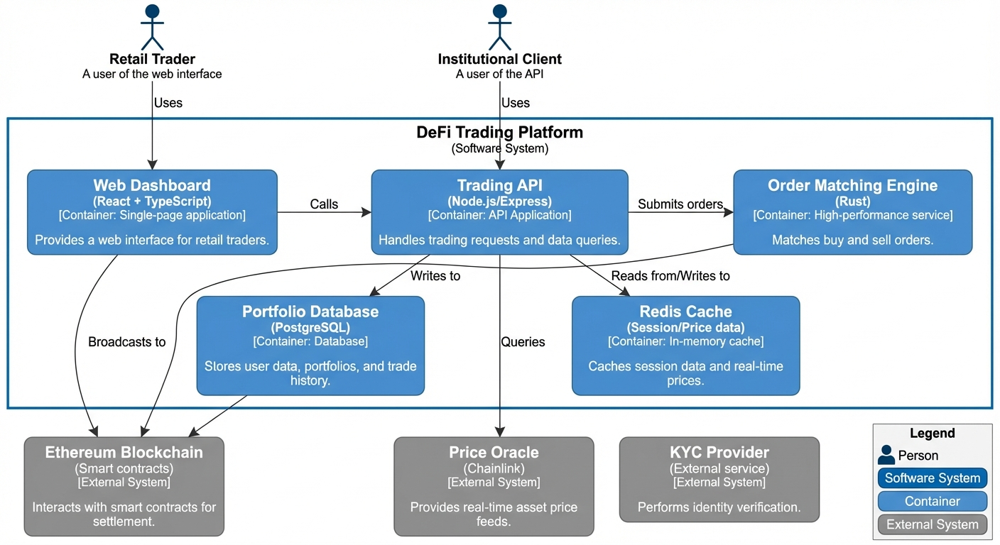

# Phase 11: Visual Diagram Generation (Gemini Image)

**Status**: ✅ Implemented (v1.2.11)
**Target Version**: v1.3.0
**Created**: 2025-12-20

## Overview

Add a new "Preview" feature that uses Google's `gemini-3-pro-image-preview` model to generate presentation-ready C4 diagrams as PNG images directly from text descriptions.

## Epic: Visual C4 Diagram Generation

### User Story

> As a software architect, I want to generate polished, presentation-ready C4 diagrams from my text notes without learning DSL syntax, so I can quickly communicate architecture in meetings and documents.

### Features

#### 1. New Menu Command: "C4X: Preview - Visual Diagram (Gemini)"
- **Trigger**: Right-click menu on markdown files
- **Input**: Selected text or full document content
- **Output**: PNG image saved to same folder, embedded in markdown

#### 2. Smart C4 Level Detection
- Automatically detects if context is C1 (System Context), C2 (Container), C3 (Component), or Deployment
- Uses semantic analysis of keywords and structure

#### 3. Consistent Visual Styling
- Include reference images in prompt for style grounding
- Match official C4 Model color scheme and notation
- Generate legend/key with each diagram

#### 4. Auto-Embed in Markdown
- After generation, insert `` at cursor position
- Unique filename with timestamp to avoid collisions

## Technical Requirements

### Model Configuration
- **Model**: `gemini-3-pro-image-preview`
- **Input**: Text + Reference Images (for style grounding)
- **Output**: PNG image (base64 decoded)

### Visual Design System Prompt
Include grounding references for:
- Color palette (Person: #08427B, System: #1168BD, etc.)
- Shape standards (rounded rectangles, stick figures)
- Arrow styles (solid, dashed, dotted)
- Layout conventions (TB for hierarchy, LR for flows)
- Legend requirements

### File Handling
- Save PNG to same directory as source markdown
- Filename: `c4x-visual-{timestamp}.png`
- Update markdown with relative path reference

## Acceptance Criteria

- [x] User can right-click and select "Preview - Visual Diagram (Gemini)"
- [x] AI correctly detects C4 level from context
- [x] Generated PNG follows C4 Model visual standards
- [x] PNG is saved to correct location
- [x] Markdown is updated with embedded image reference
- [x] **Robustness**: AI Self-Correction handles parser errors (v1.2.2 hotfix)
- [x] **Robustness**: Input sanitization prevents previous image filenames from appearing in new diagrams (v1.2.11)
- [x] **Visual Grounding**: Dual references (Diagram + Key) and strict layout guidelines injected (v1.2.4)

## Dependencies

- Google Generative AI SDK (existing)
- `gemini-3-pro-image-preview` model access

## Example Output

## Related

- **ADR**: [013-gemini-visual-diagram-generation.md](../../adrs/013-gemini-visual-diagram-generation.md)
- **Reference Images**:
  - [System Context](../../../examples/SystemContext.png)
  - [Containers](../../../examples/Containers.png)
