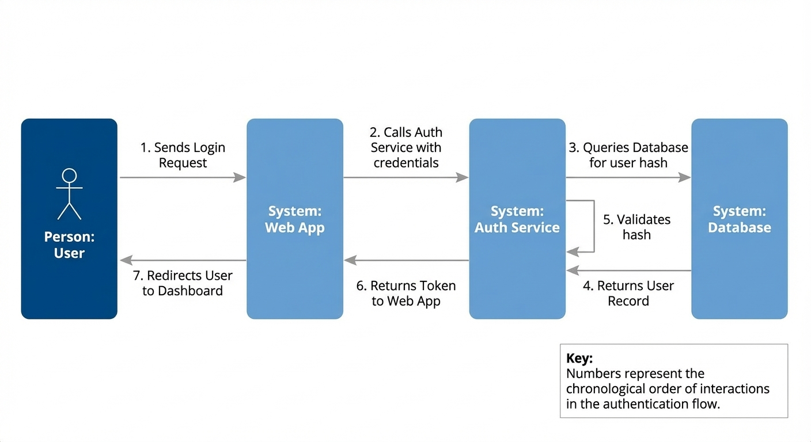

# Sequence Diagram Sample

## Input Text (Interaction Flow)
"Visualise the authentication sequence:
1. User sends Login Request to Web App.
2. Web App calls Auth Service with credentials.
3. Auth Service queries Database for user hash.
4. Database returns User Record.
5. Auth Service validates hash.
6. Auth Service returns Token to Web App.
7. Web App redirects User to Dashboard."

## Detected Framework
**Sequence** (Ordered Interactions)

## Generated Output (Visual Only)

```c4x
%%{ c4: container }%%
graph LR
  Person(UserActor, "User", "Standard system user")

  subgraph AuthenticationSystem {
    Container(WebApp, "Web App", "Provides UI and handles session redirection")
    Container(AuthService, "Auth Service", "Business logic for validation and token generation")
    ContainerDb(AuthDB, "Database", "Relational store for user records and hashes")
  }

  UserActor -->|Sends Login Request| WebApp
  WebApp -->|Calls with credentials| AuthService
  AuthService -->|Queries user hash| AuthDB
  AuthService -->|Returns Auth Token| WebApp
  WebApp -->|Redirects to Dashboard| UserActor
```


